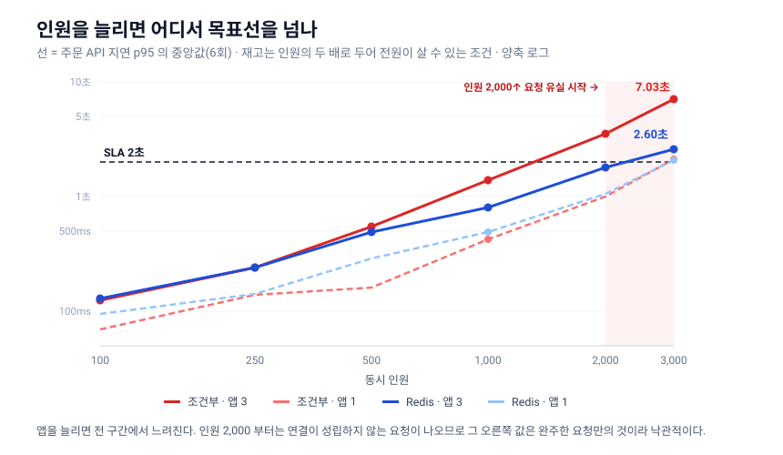

# commerce — 핫딜 커머스 백엔드

**선착순 한정 재고를 트래픽 폭주 속에서 초과 판매 0건으로 파는 백엔드.** 재고 동시성 3전략을 같은 워크로드로 벤치마크해 운영 전략을 실측으로 고르고, 토스 결제의 거절·통신오류·미확정까지 정합성 있게 처리한다.

[](https://github.com/Ting97ok/hotdeal-commerce/actions/workflows/ci.yml)   

- **현재**: 모놀리식으로 핵심 흐름 완성 — 핫딜 등록 → 주문(재고 선점·미결제 만료) → 토스 결제 실연동 → 미확정(IN_DOUBT) 해소 스케줄러
- **다음(확정 로드맵)**: 결제 후속 처리 부분 MSA 분리 → 대용량 조회 + Redis 캐싱
- **만들지 않는 것**: 넓은 커머스 기능(장바구니·리뷰·배송·쿠폰)과 풀 MSA 인프라(게이트웨이·서비스 디스커버리)는 이 저장소의 관심사 밖이다

> 📖 **의사결정 기록** [ADR 7편](docs/adr/README.md) · 측정과 근거 [재고 동시성 벤치마크](docs/rfc/concurrency-benchmark.md) · [결제 결과 분류](docs/rfc/payment-result-classification.md) · 스키마 [데이터 모델](docs/design/erd.md)

## 증명하는 것 / 증명하지 않는 것

실무에서 다뤄 보지 않은 고동시성·정합성 처리를 직접 설계하고 측정한 개인 프로젝트다.

> 패키지명 `com.sparta` 는 시작 시점의 잔재다 — 팀스파르타 **MSA 아키텍처 과정**(고용노동부 재직자 훈련, 2026.03~07)에서 출발해 개인 저장소로 이관·확장했다(커밋 이력 보존).

**증명한다**

- **측정으로 검증하는 방법론** — 측정 오염을 찾아 결론을 번복했고, 데이터가 가설을 뒷받침하지 않을 때 그대로 기록했다
- **스케일아웃의 한계, 그리고 측정 자체의 한계** — LB 뒤 앱 1대 vs 3대를 인원별로 6회씩 실측. 락 대기 누적이 13배 이상 늘어 재고 행 경합을 확인했고, 같은 격자를 세 번 돌려 **어느 결론이 재현되고 어느 것이 안 되는지**를 갈랐다
- **동시성 해법의 트레이드오프** — 낙관적 락·조건부 UPDATE·Redis 세 전략을 같은 워크로드로 재고 비교했다
- **정합성과 불변식** — 초과 판매 0건과 거짓 성공 0건을 계층 방어와 재고 장부 검증식으로 지킨다

**증명하지 않는다**

- **실트래픽과 실 프로덕션 규모** — 측정은 로컬 한 머신이다. 다중 인스턴스도 같은 머신 위 컨테이너라 물리 분산이 아니다. 부하 도구·앱·DB 를 각각 다른 기기에 두는 측정은 **장비 여건상 하지 못했다**([벤치마크 RFC 6절](docs/rfc/concurrency-benchmark.md))
- **장애 대응 운영** — 알람을 붙이지 않았다. 재고 전략은 프로퍼티 한 줄로 되돌리게 만들어 두었지만 실제로 되돌려 본 것은 아니다
- **실거래** — 토스는 테스트 모드다

> 그래서 이 저장소가 보이는 것은 "고트래픽을 겪었다"가 아니라 **"고트래픽을 설계하고 검증할 수 있다"** 이다.

## 핵심 결과 — 재고 동시성 벤치마크

### ① 인원을 늘리면 어디서 깨지나 — 그리고 어디까지가 믿을 만한 값인가

nginx 로드밸런서 뒤에 앱을 1대와 3대로 두고, 인원을 100에서 3,000까지 올리며 각 지점을 **6회씩** 쳤다.



**세 번의 실행에서 흔들리지 않은 것**

- **초과 판매 0건** — 인원 3,000까지 전 구간, 재고 10에 1,000명이 몰려도 성공은 정확히 10건.
- **재고 행 락 경합은 실재하고, 앱을 늘리면 커진다** — 조건부 UPDATE 의 락 대기 누적이 앱 1대→3대에서 13배 이상 늘었다. 대기 횟수는 요청 수와 같으니 건당 대기가 길어진 것이다. Redis 는 재고 행을 건드리지 않아 정확히 0.
- **커넥션 풀이 병목이고, Redis 는 그 대기를 46% 줄인다** — 획득 대기 누적이 조건부 481초, Redis 258초. 그만큼 무관한 조회도 덜 밀린다(45%). **순간값(사용 중 30 대 10)으로 판정하면 "Redis 는 여유가 있다"로 정반대로 읽힌다** — 락 경합에서 겪은 샘플링 함정을 커넥션에서 되풀이할 뻔했다.
- **순간을 찍는 관측으로는 안 보인다** — `row_lock_current_waits` 는 전 스냅샷 0인데 같은 회차의 누적 델타는 204초. 대기가 짧고 잦으면 순간 관측은 놓친다.

**말할 수 없다고 결론 낸 것**

- **두 전략의 지연 우열** — 같은 격자를 세 번 돌렸더니 인원 2,000 이상에서 결과가 뒤집혔다. 인원 3,000·앱 3대에서 조건부가 이겼다가, 비슷했다가, Redis 가 이겼다. 회차를 6회로 늘려도 좁혀지지 않는다. 부하 도구와 서버가 한 기기에 있는 한 편차의 원인이 측정 대상 밖에 있다.
- **인원 2,000 이상의 절대값** — 그 구간부터 연결이 성립하지 않는 요청이 나오고, 유실분은 지연에 안 잡혀 값이 낙관적으로 편향된다.

측정 설계와 회차별 원값은 [동시성 벤치마크 RFC 4절](docs/rfc/concurrency-benchmark.md).

### ② 전략 선정 — 같은 워크로드로 3전략 실측

동시 1,000명이 재고 한 행을 다투는 오픈 스파이크를 낙관적 락 · 조건부 UPDATE · Redis+Lua 로 측정해 **원자적 조건부 UPDATE** 를 운영 전략으로 확정했다 — [재고 동시성 ADR](docs/adr/concurrency.md).


- 낙관적 락은 버전 충돌로 성공 163/1000 (정확하나 비실용, 탈락). 조건부·Redis 는 1,000 동률.
- 조건부가 p95 최저(1.37s)이고 쿼리 한 문장이라 가장 단순해 채택했다. 여기서 도출한 SLA 는 폭주 p95 ≤ 2s · 평시 ≤ 500ms — [동시성 벤치마크 RFC 3·5절](docs/rfc/concurrency-benchmark.md).

### ③ 측정 오염 발견이 결론을 바꿨다

호스트 측정에선 Redis 가 앞서 보였으나 원인은 조건부만 겪는 SQL DEBUG 로깅 오염이었다. 격리 스택(tmpfs DB·로그 차단) 재측정에서 그 격차가 사라졌다.


- 조건부는 차감이 DB UPDATE 라 로깅에 민감하고 Redis 는 메모리라 둔감했다 — 오염이 한쪽만 때린 것이다 ([동시성 벤치마크 RFC 3절](docs/rfc/concurrency-benchmark.md))
- 재현: `bash k6/benchmark/run.sh`(단일) · `bash k6/benchmark/run-multi.sh`(1 vs 3 인스턴스) — 일회용 컨테이너로 전략 순회 + 초과 판매 검증 자동 ([k6 실행 안내](k6/README.md))

## 설계 하이라이트

- **초과 판매 0건은 겹치기가 아니라 분업으로 막는다** — 앱 검증(사유 있는 거절) · DB 유니크와 조건부 UPDATE(동시 경합) · CHECK 제약 9개(코드가 뚫려도) · 장부 검증식(설계 결함). 각 층은 다른 층이 못 하는 일을 맡는다 · [주문 ADR 7절](docs/adr/order.md)
- **1인 1주문을 DB 가 직렬화** — MySQL 부분 유니크 부재를 저장 생성 컬럼(`is_active`)으로 우회한 활성 유니크 · [주문 ADR 4절](docs/adr/order.md)
- **토스 호출은 트랜잭션 밖** — 선점(TX1) → confirm(TX 밖) → 결과 반영(TX2). 승인/거절/통신오류/미확정 sealed 4분기, 미확정(IN_DOUBT)은 해소 스케줄러가 토스 재조회로 확정 · [결제 ADR 4·6절](docs/adr/payment.md)
- **상태 전이 전부 조건부 UPDATE** — 결제↔만료 경합은 진 쪽이 영향 행 0 으로 그 사실을 안다 · [주문 ADR 3절](docs/adr/order.md)
- **진행·매진을 저장하지 않는다** — 판매 기간과 재고를 그때 읽어 판단해서 핫딜 상태를 바꾸는 스케줄러가 통째로 없다 · [핫딜 ADR 1절](docs/adr/hotdeal.md)
- **계층에 예외를 두지 않는다** — 예외 하나가 다음 사람에게는 규칙을 다시 읽는 선례가 된다 · [애플리케이션 구조 ADR 1절](docs/adr/architecture.md)
- **인증 검증을 Redis 핫패스에서 뺐다** — 무상태 JWT + Refresh 회전(Redis `GETDEL` 원자 소비로 동시 재발급 차단) · [인증 ADR 3절](docs/adr/auth.md)
- DB FK 제약 미사용 — 참조는 서비스 가드와 권한이 지킨다 · [참조 무결성 ADR](docs/adr/integrity.md)

## 기술 스택

| 영역 | 스택 | 비고 |
|---|---|---|
| 언어 | Java 21 | 최신 LTS |
| 프레임워크 | Spring Boot 3.5.13 | 안정·레퍼런스 우선 (4.0 호환 리스크 회피) |
| 웹 서버 | Undertow | 경량 |
| 영속성 | Spring Data JPA + QueryDSL 5.0 | 동적 쿼리·프로젝션 |
| DB | MySQL 8.4 LTS | 8.0 EOL(2026.4) → 8.4 LTS |
| 마이그레이션 | Flyway | 스키마 버전 관리 |
| 캐시·토큰 | Redis 7 | Refresh 토큰 저장 · 재고 전략 비교(벤치마크) |
| 매핑 | MapStruct | 엔티티 ↔ DTO |
| 문서화 | SpringDoc OpenAPI | Swagger UI |
| 테스트 | JUnit 5 + Testcontainers(MySQL 8.4) | 운영 동일 마이그레이션 검증 |
| 부하 테스트 | k6 (+ Prometheus·Grafana) | [동시성 벤치마크 RFC 2절](docs/rfc/concurrency-benchmark.md) |

> 표준 스택은 한 줄 근거만. 트레이드오프가 있던 의사결정(인증·아키텍처·PG·동시성 제어)은 [docs/adr](docs/adr/README.md) 에 기록한다.

## 로컬 실행

```bash
docker-compose up -d      # MySQL 8.4 + Redis 7
./gradlew bootRun         # http://localhost:8080
```

- Swagger UI: `http://localhost:8080/swagger-ui.html`

## 빌드 / 테스트 / 벤치마크

```bash
./gradlew compileJava            # 컴파일 (QueryDSL Q클래스 생성)
./gradlew test                   # 통합 테스트 (Testcontainers — Docker 필요)
bash k6/benchmark/run.sh         # 동시성 벤치마크 (일회용 격리 스택 — Docker + k6 필요)
```
