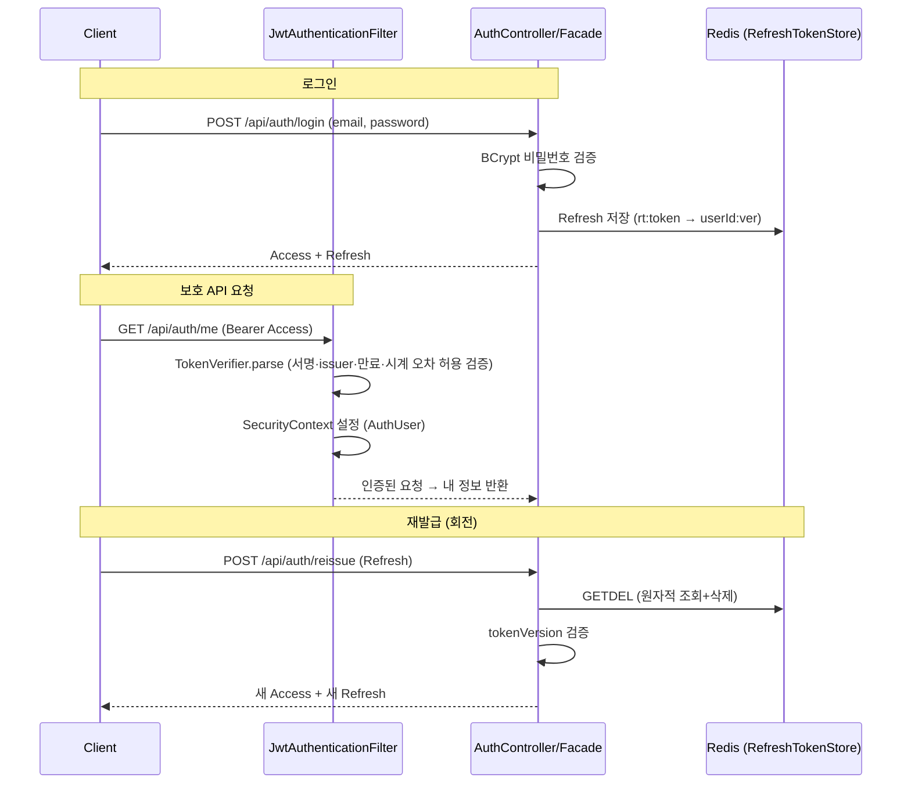

# 인증 — 의사결정 기록

무상태 JWT 인증과 Role 기반 인가를 어떻게 세웠는지, 그 대가를 무엇으로 갚았는지 정한 기록.
Access Token(단기) + Refresh Token(RTR, Redis) 구성이다.

**결론**

- Redis 를 안 쓰는 것이 아니라 **인증 핫패스에서 뺐다.** 매 요청 검증은 로컬 서명으로 끝난다
- 그 대가는 만료 전 무효화가 안 된다는 것이고, **Access 단기 + RTR + tokenVersion** 으로 갚는다
- 동시에 같은 Refresh 로 두 번 재발급하는 경합은 Redis `GETDEL` 한 명령이 막는다
- 소비를 검증보다 **먼저** 한다. 순서를 뒤집으면 `GETDEL` 원자성이 깨진다

---

## 1. Redis 를 안 쓰는 것이 아니라 인증 핫패스에서 뺀다

**세션도 Redis 로 확장되므로 JWT 가 절대 우위는 아니다.** 이것은 트레이드오프 선택이다.

흔한 반문부터 짚는다 — "JWT 도 Refresh 를 Redis 에 두니 결국 세션과 같은 것 아니냐". 저장소가 Redis 인 것은 같다. 다른 것은 **인증 검증이 Redis 를 거치는 빈도**다.

| | 세션 | JWT (이 프로젝트) |
|---|---|---|
| 매 요청 인증 검증 | 세션 ID 로 Redis 조회 1회(네트워크 왕복) | **로컬 서명 검증** — Redis 를 안 간다 |
| Redis 접근 시점 | 모든 요청 | **재발급 때만** — Access 만료 주기인 30분당 1회 |
| Redis 장애 시 | 전원 인증 불가 | **Access 검증은 지속** — 재발급만 막힌다 |
| 여러 서비스로 전파 | 서비스들이 같은 세션 저장소를 공유 | 각 서비스가 **토큰만으로 독립 검증** |

- 고빈도 조회에서 인증 때문에 매 요청 Redis 를 왕복하지 않는다. 지연·부하·장애 격리가 함께 따라온다
- 결제 후속을 떼어낼 때 각 서비스가 토큰만으로 검증하는 이점도 같은 뿌리다

트레이드오프

| 대가 | 대응 |
|---|---|
| 서명이 유효하면 만료까지 유효하다. 만료 전 강제 무효화가 안 된다 | Access 를 30분으로 짧게 두고, Refresh 는 재발급마다 회전시키며, 전역 무효화는 `tokenVersion` 이 맡는다(2·3절) |

## 2. 만료 시간은 비대칭으로 둔다

| 토큰 | 형식 | 내용 | 만료 |
|---|---|---|---|
| **Access** | JWT (HS256) | `sub`=userId · `roles`=[ROLE_*] · `iss`=commerce | **30분** |
| **Refresh** | 불투명(UUID) | Redis `rt:{token}` → `userId:tokenVersion` | **14일** |

정해진 정답 숫자는 없다. 두 축의 절충이고 **Access 짧게 · Refresh 길게** 라는 비대칭이 핵심이다.

- **Access 30분** — 무상태 토큰은 **만료 시간이 곧 탈취 시 최대 노출 창**이다. 짧을수록 안전하지만 재발급(Redis 왕복)이 잦아진다
  - 결제를 포함한 커머스라 보안 쪽으로 기울여 1시간보다 짧게 두되, 5~15분은 재발급이 과해 30분으로 절충했다
- **Refresh 14일** — 재로그인 없이 앱을 쓸 수 있는 기간이다. 길수록 편하고 그만큼 탈취 위험 창도 길어진다
  - 이 위험은 회전과 `tokenVersion` 이 흡수한다. 재발급마다 회전하므로 실제로는 "마지막 활동 기준"으로 동작한다
- Access 는 자체 검증(서명·만료·issuer)이라 무상태고, Refresh 는 Redis 에만 있는 불투명 값이라 서버가 무효화할 수 있다

## 3. 재발급 경합은 `GETDEL` 한 명령이 막는다

- 재발급 시 기존 Refresh 를 **1회용으로 폐기**하고 새 Refresh 를 발급한다
- 조회와 삭제를 Redis `GETDEL`(6.2+) 한 명령으로 **원자 처리**한다
  - `GET` 후 `DEL` 을 따로 하면 그 사이에 다른 요청이 끼어든다
  - `GETDEL` 은 그 틈이 없어, 같은 Refresh 로 동시에 두 번 재발급해도 **한쪽만 값을 받고 나머지는 실패**한다(`REFRESH_TOKEN_NOT_FOUND`)
- 전역 무효화는 `tokenVersion` 이 맡는다. `logout-all` 이 `User.tokenVersion` 을 올리고, Refresh 에 박힌 버전과 다르면 거부한다(`TOKEN_REVOKED`) — 모든 기기가 함께 로그아웃된다

**소비를 검증보다 먼저 한다**

- `GETDEL` 로 먼저 소비하고 그다음 `tokenVersion` 을 검증한다
- 버전 불일치로 거부되는 Refresh 는 **이미 `logout-all` 로 무효화된** 토큰이라 소비돼도 잃을 것이 없다
- "선검증 후 소비"로 바꾸면 `GET` 과 `DEL` 이 갈라져 위 원자성이 깨진다. 동시 재발급 방어가 사라지므로 현재 순서를 유지한다

**아직 하지 않은 것 — 재사용 감지.** 이미 회전돼 삭제된 Refresh 가 다시 들어오면 탈취 정황이다. 지금은 단순 거부에 그친다. 토큰에 family 식별자를 부여해 추적하면 재사용을 감지해 `tokenVersion` 을 올려 해당 사용자 전체를 무효화할 수 있다(OWASP 권장). 저장 구조가 늘어 메인 기능 뒤로 미뤘다.

## 4. 인가는 경로로 가른다

| 경로 | 권한 |
|---|---|
| `/api/auth/{signup,login,reissue,logout}` | permitAll |
| `/api/admin/**` | `hasRole(ADMIN)` |
| 그 외 (`/logout-all`·`/me` 등) | authenticated |

- `logout` 은 요청 본문의 refresh 로 처리하므로 permitAll 이다. **Access 가 만료된 뒤에도 폐기할 수 있어야** 하기 때문이다. `logout-all` 은 본인 식별이 필요해 authenticated 다
- 인증 실패는 **401**(`JwtAuthenticationEntryPoint`), 권한 부족은 **403**(`JwtAccessDeniedHandler`). 둘 다 래핑된 `{result, error:{code, message}}` 로 나간다

## 5. 막아 둔 공격 표면

- **issuer 검증**(`requireIssuer`) — 같은 시크릿을 쓰는 다른 발급자의 토큰을 거부한다
- **시계 오차 허용**(30초) — 인스턴스가 늘면 발급 서버와 검증 서버의 시계가 어긋날 수 있어, 경계 시점 토큰이 오차로 잘못 거부되는 것을 막는다
- **알고리즘 혼동 방어** — 대칭키(HS256) 검증으로 `alg:none` 과 키 타입 불일치 토큰을 거부한다
- **CORS** — origin 화이트리스트(`http://localhost:*`) + credentials. 와일드카드를 쓰지 않는다
- **시크릿 키 32바이트 이상**을 부팅 시 검증한다. 발급(`TokenIssuer`)과 검증(`TokenVerifier`)이 `JwtKeyHolder` 한 곳에서 키를 받는다
- 비밀번호는 BCrypt 로 해시한다

## 6. 테스트로 명세한 것

통합 테스트(Testcontainers MySQL + Redis)다.

| 영역 | 케이스 |
|---|---|
| 회원가입 | 정상 저장 · 이메일 중복(409) · 형식 검증(400) |
| 로그인 | 성공(토큰 발급) · 비밀번호 오류(401) |
| 보호 API | `/me` 인증(200) · 토큰 없음(401) · 변조(401) · **만료(401)** · **issuer 불일치(401)** · **`alg:none`(401)** |
| 인가 | USER 가 admin 경로 호출(403) |
| 재발급 | 성공(회전) · **동시 2요청 → 1개만 성공**(`CountDownLatch`) |
| 로그아웃 | refresh 폐기 · 전역(tokenVersion) 무효화 · **access 없이 폐기** |

- 재발급 동시 2요청이 3절 `GETDEL` 원자성의 명세다. 한쪽만 새 토큰을 받는 것을 실제 Redis 로 확인한다
