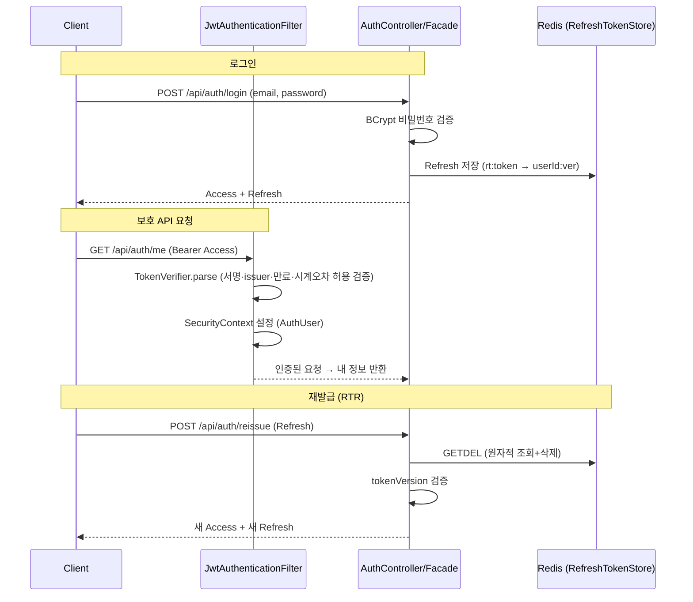

# 인증 / 인가 설계

무상태(stateless) **JWT 인증** + **Role 기반 인가**. Access Token(단기) + Refresh Token(RTR, Redis).

> 의사결정 트레이드오프는 [ADR](../adr/)에, 본 문서는 *설계 상세 + 근거*를 다룬다.

---

## 1. 왜 JWT인가 (세션 대비)

**세션도 Redis로 확장 가능하므로 JWT가 절대 우위는 아니다.** 이건 트레이드오프 선택이다.

흔한 오해부터 짚으면 — *"JWT도 Refresh를 Redis에 두니 결국 세션과 같은 것 아니냐"*. 저장소가 Redis인 건 같다. 다른 건 **인증 검증이 Redis를 거치는 빈도**다.

| | 세션 | JWT(이 프로젝트) |
|---|---|---|
| 매 요청 인증 검증 | 세션ID로 **Redis 조회 1회**(네트워크 왕복) | **로컬 서명 검증**(Redis 안 감) |
| Redis 접근 시점 | 모든 요청 | **재발급 때만**(Access 만료 시 ≈ 30분당 1회) |
| Redis 장애 시 | 전원 인증 불가 | **Access 검증은 지속**(재발급만 막힘) |
| MSA 전파 | 서비스들이 같은 세션 스토어 공유 | 각 서비스가 **토큰만으로 독립 검증** |

→ Redis를 **안 쓰는** 게 아니라 **인증 핫패스에서 빼는** 것이다. MAU 10만·고빈도 조회에서 인증 때문에 매 요청 Redis를 왕복하지 않는다(레이턴시·부하·장애 격리에 유리). MSA 전환 시 각 서비스가 토큰만으로 검증하는 이점도 같은 뿌리다.

대신 **무효화가 어렵다**(서명이 유효하면 만료까지 유효)는 약점이 있다. 이를 **Access 단기(30분) + Refresh RTR + tokenVersion**으로 보완한다. (세션 vs JWT 상세 비교는 ADR 참조)

---

## 2. 토큰 구조

| 토큰 | 형식 | 내용 | 만료 |
|---|---|---|---|
| **Access** | JWT (HS256) | `sub`=userId · `roles`=[ROLE_*] · `iss`=commerce | **30분** |
| **Refresh** | 불투명(UUID) | Redis `rt:{token}` → `userId:tokenVersion` | 14일 |

- Access는 자체 검증(서명·만료·issuer) → 무상태.
- Refresh는 Redis에만 존재하는 불투명 토큰 → 서버가 무효화 가능.

### 만료 시간 — 왜 이 값인가

정해진 정답 숫자는 없다. 두 축의 절충이고, **비대칭**(Access 짧게·Refresh 길게)이 핵심이다.

- **Access 30분** — 무상태 토큰은 만료 전 강제 무효화가 안 되므로 **만료 시간 = 탈취 시 최대 노출 창**이다. 짧을수록 안전하지만, 짧을수록 재발급(Redis 왕복)이 잦아진다. 결제를 포함한 커머스라 보안 쪽으로 기울여 1시간보다 짧게, 다만 5~15분은 재발급이 과해 30분으로 절충.
- **Refresh 14일** — 재로그인 없이 앱을 쓸 수 있는 기간(편의). 길수록 편하지만 탈취 위험 창도 길어진다. 이 위험은 **RTR(1회용 회전) + tokenVersion(전역 무효화)** 이 흡수한다 — 재발급마다 회전하므로 실제로는 "마지막 활동 기준"으로 동작.

긴 Refresh의 위험을 편의를 위해 받되, 그 위험을 RTR·tokenVersion으로 되갚는 구조다.

---

## 3. 인증 / 인가 플로우

### 인가 (경로 기반)
| 경로 | 권한 |
|---|---|
| `/api/auth/{signup,login,reissue,logout}` | permitAll |
| `/api/admin/**` | `hasRole(ADMIN)` |
| 그 외 (`/logout-all`·`/me` 등) | authenticated |

- `logout`은 refresh 본문 기반이라 permitAll — *access 만료 시에도 폐기 가능*. `logout-all`은 본인 식별이 필요해 authenticated.
- 인증 실패 → **401** (`JwtAuthenticationEntryPoint`), 권한 부족 → **403** (`JwtAccessDeniedHandler`). 둘 다 `ApiResponse`(`{result:false, error:{code,message}}`) 형식으로 반환.

---

## 4. RTR (Refresh Token Rotation)

- 재발급 시 **기존 Refresh는 1회용으로 폐기**하고 새 Refresh 발급.
- **GETDEL 원자성**: Redis `GETDEL`(6.2+, *조회와 삭제를 한 명령으로 원자 처리*)로 refresh 조회+삭제를 원자화한다. `GET` 후 `DEL`을 따로 하면 그 사이에 다른 요청이 끼어들 수 있지만(경쟁), `GETDEL`은 그 틈이 없다 → *동시에 같은 Refresh로 2번 재발급해도 1개만 값을 받고 나머지는 실패*(`REFRESH_TOKEN_NOT_FOUND`). 토큰 탈취·경쟁 방어.
- **tokenVersion(전역 무효화)**: `logout-all` 시 `User.tokenVersion++`. Refresh에 박힌 버전과 불일치하면 거부(`TOKEN_REVOKED`) → 모든 기기 로그아웃.
- **검증 순서**: `GETDEL`(소비)을 먼저 하고 tokenVersion을 검증한다. 버전 불일치로 거부되는 Refresh는 *이미 logout-all로 무효화된* 토큰이라 소비(삭제)돼도 손실이 없다. "선검증 후 소비"로 바꾸면 GET/DEL이 분리돼 GETDEL 원자성(동시 재발급 방어)이 깨지므로 현재 순서를 유지한다.

> **향후 과제 — 재사용 감지(reuse detection)**: 이미 회전된(삭제된) Refresh가 다시 들어오면 *탈취 정황*이다. 현재는 단순 거부(`REFRESH_TOKEN_NOT_FOUND`)지만, 토큰에 family/chain id를 부여해 추적하면 재사용 감지 시 `tokenVersion++`로 해당 사용자 전체를 무효화할 수 있다(OWASP 권장). 저장 구조가 늘어 메인 기능 이후로 보류.

---

## 5. 보안 고려

- **issuer 검증**(`requireIssuer`): 같은 시크릿을 쓰는 다른 발급자의 토큰을 거부.
- **시계 오차 허용**(clock skew 30초): 스케일아웃·MSA로 인스턴스가 늘면 발급/검증 서버의 시계가 어긋날 수 있어, 경계 시점 토큰이 오차로 잘못 거부되는 것을 막는다.
- **alg confusion 방어**: 대칭키(HS256) 검증으로 `alg:none`·키 타입 불일치 토큰을 거부.
- **CORS**: origin 화이트리스트(`http://localhost:*`) + credentials (와일드카드 `*` 금지).
- **시크릿 키 ≥ 32바이트** 검증(부팅 시) — 발급(`TokenIssuer`)·검증(`TokenVerifier`)이 `JwtKeyHolder` 한 곳에서 키를 생성·검증.
- 비밀번호 **BCrypt** 해시.

---

## 6. 테스트 (통합 — Testcontainers MySQL + Redis)

| 영역 | 케이스 |
|---|---|
| 회원가입 | 정상 저장 · 이메일 중복(409) · 형식 검증(400) |
| 로그인 | 성공(토큰 발급) · 비밀번호 오류(401) |
| 보호 API | `/me` 인증(200) · 토큰 없음(401) · 변조(401) · **만료(401)** · **issuer 불일치(401)** · **alg:none(401)** |
| 인가 | USER → admin 경로(403) |
| 재발급 | 성공(회전) · **동시 2요청 → 1개만 성공**(`CountDownLatch`, GETDEL 원자성) |
| 로그아웃 | refresh 폐기 · 전역(tokenVersion) 무효화 · **access 없이 폐기(permitAll)** |
