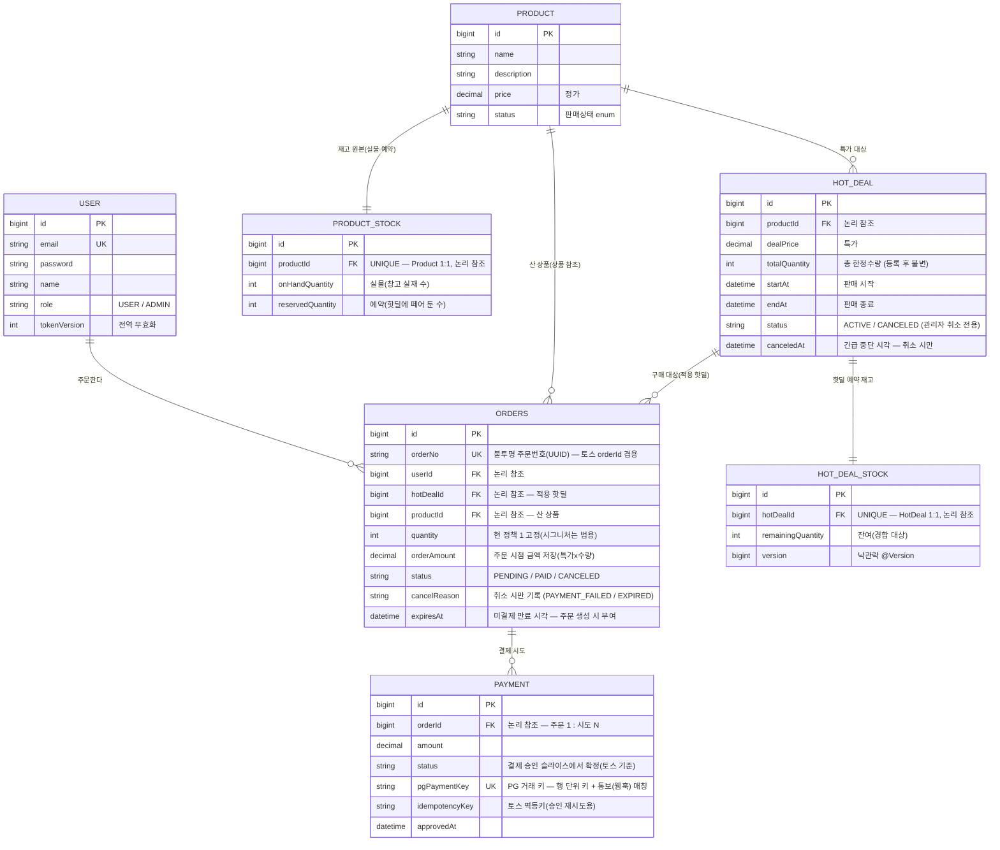

# 데이터 모델 (ERD) — 핫딜 동시성 관점

> 1주차 개략 설계. 행동 규칙·범위는 [기술 가설](hotdeal-purchase-hypothesis.md)이 상위 기준(그 위는 [가설 PRD](hotdeal-prd.md))이고,
> 본 문서는 그 가설을 **데이터 모양**으로 옮긴 것이다. **결정의 이유(대안·트레이드오프)는 전부 [ADR](../adr/README.md)** — 본 문서는 결정된 모델만 적는다.
> 표기: 기술 용어는 첫 등장에 한 줄 풀이를 병기한다. auth/user 는 구현 완료 — [auth.md](auth.md).

---

## 1. 한눈에 — 엔티티 관계

> - 표기: `PK` = 기본 키 · `UK` = 유니크(같은 값이 두 번 저장될 수 없음) · `FK` = 참조 — **논리적 표기일 뿐, 물리 DDL(실제 테이블 생성 SQL)에는 FK 제약을 걸지 않는다** ([ADR-0003](../adr/0003-no-db-fk-constraints.md)).
> - MySQL 예약어 회피로 주문 테이블명은 `orders`. 위 컬럼은 개략 — 실제 매핑/제약은 마이그레이션에서 확정.

---

## 2. 엔티티 역할

| 엔티티 | 역할 | 핫딜 동시성에서의 위치 |
|---|---|---|
| **User** | 구매자(이미 구현) | 경합 무관 |
| **Product** | 상품 카탈로그(정가·설명) | 핫딜이 참조하는 대상 — 엔티티·마이그레이션은 핫딜과 **함께 생성**. 재고는 이 행이 아니라 **`ProductStock`에 분리**(경합 격리를 상품 레벨로 — [ADR-0011](../adr/0011-product-inventory-reservation.md)). 구매는 핫딜 경유라 쓰기 경합 없음 |
| **ProductStock** | 상품 재고 **원본**(실물·예약) | 가용=실물−예약(계산, 저장 안 함). 핫딜 등록이 여기서 **예약**, 결제확정이 실물·예약 차감 — 등록/취소·결제확정(저경합)만 건드려 핫 패스와 분리 ([ADR-0011](../adr/0011-product-inventory-reservation.md)) |
| **HotDeal** | 한정 수량·기간 특가 | 선착순 구매가 일어나는 곳. 가격/기간 **메타**만 — 진행/매진 상태값 없음 ([ADR-0007](../adr/0007-hotdeal-state-operations.md)) |
| **HotDealStock** | HotDeal 예약 재고 행 | **동시성 핫스팟**(경합이 한 지점에 집중되는 자리) — 모든 동시 구매가 이 한 행을 차감 |
| **Order** | 구매 1건(회원 × 핫딜) | 산 상품(`product`) + 적용 핫딜(`hot_deal`) 참조 · 주문 시점 금액 저장 · 1인 1개 유니크 · 불투명 주문번호 · 선점 만료 시각 · 취소 사유 |
| **Payment** | 토스 결제 **시도** 기록 — **행 단위 = paymentKey 1개** | 토스 호출 ↔ DB 트랜잭션 분리 지점. 실패 시도도 행으로 보존 ([ADR-0008](../adr/0008-payment-model-pg-boundary.md)) |

---

## 3. 관계 · 카디널리티(1:1, 1:N 같은 대응 개수)

| 관계 | 카디널리티 | 비고 |
|---|---|---|
| User → Order | 1 : N | 같은 핫딜은 살아 있는 주문 1건 ([ADR-0005](../adr/0005-one-per-user-active-unique.md)) |
| Product → ProductStock | 1 : 1 | 재고 원본 분리 — 경합 격리를 상품 레벨로 ([ADR-0011](../adr/0011-product-inventory-reservation.md)) |
| Product → HotDeal | 1 : N | 회차(추가 물량 = 새 핫딜) 모델 지원. 판매 기간 겹침은 등록 검증으로 금지 ([ADR-0007](../adr/0007-hotdeal-state-operations.md)) |
| Product → Order | 1 : N | 주문이 산 상품 참조(적용 핫딜은 `hot_deal`) ([ADR-0011](../adr/0011-product-inventory-reservation.md)) |
| HotDeal → HotDealStock | 1 : 1 | 핫딜 예약 재고 행 — 경합 격리 ([ADR-0009](../adr/0009-stock-concurrency-design.md)) |
| HotDeal → Order | 1 : N | 한 핫딜에 여러 구매 |
| Order → Payment | **1 : N** | 행 단위 = paymentKey(PG 거래 키) 1개 — 같은 멱등키 재시도는 기존 행 갱신. 승인 1건 보장은 주문 상태 전이(PENDING→PAID 1회)가 담당 ([ADR-0008](../adr/0008-payment-model-pg-boundary.md)) |

---

## 4. 가설 불변식 → 데이터 모델 반영

| 가설 규칙 ([가설 4](hotdeal-purchase-hypothesis.md)) | 데이터 모델에서의 구현 위치 |
|---|---|
| 오버셀 0 + 거짓 성공 0 | `HotDealStock.remainingQuantity` 차감의 원자성 + `version`(낙관락 출발점) + CHECK(`remaining >= 0`, 최후 방어선). 거짓 성공은 "응답 = 커밋된 트랜잭션"으로 차단 |
| 1인 1개 | `orders` 활성 유니크 — 생성 칼럼 (아래 '6. 물리 DDL 정책') |
| 선점 + 복원 정확히 한 번 | HotDealStock 차감과 `Order(PENDING)` 생성이 한 트랜잭션. 복원은 `PENDING→CANCELED` 조건부 갱신 성공(1행) 시에만 + `cancel_reason`. `expiresAt`(주문 생성 시 부여)으로 만료 추적 |
| 금액 조작 방지 | `Order.orderAmount` 주문 시점 저장 — 결제 검증은 서버가 이 값으로 |
| 멱등 2겹 | 내부 = 활성 유니크 / 외부 = `Payment.idempotencyKey` + 행 단위 = paymentKey |
| 장부 일치(정합 검증식) | 핫딜: `totalQuantity = remaining + Σ(활성 주문 qty)` · `주문당 승인 ≤ 1` · `PAID ↔ 승인 1:1` — 쿼리로 검증. 상품: `ProductStock.reserved` 는 활성 핫딜 예약분 — 변동 원장 정식화는 슬라이스 2 ([ADR-0011](../adr/0011-product-inventory-reservation.md) 보류) |
| 상태는 판단으로 | HotDeal 에 진행/매진 컬럼 없음. `status` 는 ACTIVE/CANCELED 만. `totalQuantity` 등록 후 불변(증량 전환 경로는 [ADR-0007](../adr/0007-hotdeal-state-operations.md)) |
| 식별자 정책 | 공개 = 순번 id / 민감 = `order_no`(UUID, UNIQUE). PK 는 순번 유지 ([ADR 인덱스 — 식별자 정책](../adr/README.md)) |

---

## 5. 동시성 핫스팟 — HotDealStock 한 행

수천 동시 구매 → 동일 HotDeal → 동일 **HotDealStock 1행** 차감. 경합은 이 한 행에 집중되며, 5방식(낙관/비관/Redis/분산락/원자적 조건부 UPDATE)을 이 한 행·키에 교체 적용해 비교한다(3주차).

- 왜 별도 테이블인가(낙관락 가짜 충돌·잠금 줄 분리·벤치마크 집중·실증 사례) → **[ADR-0009](../adr/0009-stock-concurrency-design.md)**
- **`ProductStock`은 핫스팟이 아니다** — 등록/취소(관리자)·결제확정(당첨자만·결제 창에 분산)만 건드려 저경합. 핫 패스는 `HotDealStock` 한 행으로 격리([ADR-0011](../adr/0011-product-inventory-reservation.md)).
- **검증 기준**: 동시 100요청·재고 10 → 성공 ≤ 10 + 오버셀 0 + 정합 검증식 성립 (방식별 성공 수는 비교 지표)

---

## 6. 물리 DDL 정책 + V2 마이그레이션 결정 목록

- **FK 제약 없음** — FK 칼럼(`*_id`) + 보조 인덱스(기본 키 외에 따로 만드는 검색용 색인)만 ([ADR-0003](../adr/0003-no-db-fk-constraints.md)).
- **금액** — 전 금액 칼럼 `DECIMAL(12,0)`, JPA `BigDecimal` ([ADR 인덱스 — 금액 타입](../adr/README.md)).
- **시각** — 전 칼럼 `DATETIME(6)` (V1 과 동일 정밀도).
- **재고 테이블 분리** — `product_stock`(상품 재고 원본): `product_id`(UNIQUE 논리 참조)·`on_hand_quantity`·`reserved_quantity`(version 없음 — 예약·복원은 원자적 조건부 UPDATE, [ADR-0011](../adr/0011-product-inventory-reservation.md) 결정 4). `hot_deal_stock`(핫딜 예약 재고 — 기존 `stock` 리네임): `hot_deal_id`(UNIQUE)·`remaining_quantity`·`version`(벤치마크 낙관락 변형용 유지). 가용(실물−예약)은 **저장 안 함**(조회 시 계산) ([ADR-0011](../adr/0011-product-inventory-reservation.md)).
- **상품 재고 시드** — `on_hand` 초기값은 시드/픽스처(운영 입고 API 는 스코프 밖 — [ADR-0011](../adr/0011-product-inventory-reservation.md) 보류). Product 생성 시 `product_stock` 행 동반 생성 — 핫딜 등록 가용검사가 의존하므로 "출처 없음" 재발 방지.
- **orders 칼럼 확정** — `order_no CHAR(36)`(UUID v4) · `product_id BIGINT NOT NULL`(논리 참조 — 산 상품) · `hot_deal_id BIGINT NOT NULL`(논리 참조 — 적용 핫딜) · `expires_at DATETIME(6) NOT NULL`(임시 10분 — 최종값은 슬라이스 2) · `cancel_reason VARCHAR(30) NULL`(후보: PAYMENT_FAILED·EXPIRED).
- **hot_deals 칼럼 추가** — `canceled_at DATETIME(6) NULL`(긴급 중단 시각 — 검수 쿼리가 "언제 중단됐나"에 답. 중단 사유 기록은 범위 밖 — 1인 운영).
- **활성 유니크(1인 1개)** ([ADR-0005](../adr/0005-one-per-user-active-unique.md)):
  `is_active TINYINT GENERATED ALWAYS AS (IF(status IN ('PENDING','PAID'), 1, NULL)) STORED`
  + `UNIQUE KEY uk_orders_active (user_id, hot_deal_id, is_active)` — 취소 주문(is_active=NULL)은 유일성 검사 대상에서 제외되는데 이는 SQL 표준 NULL 의미론(PostgreSQL 동일 — [ADR-0005](../adr/0005-one-per-user-active-unique.md)). **엔티티에 매핑하지 않음(DDL 전용)**.
- **제약명으로 예외 구분** — `uk_orders_active` 위반 = `ALREADY_PURCHASED` / `uk_orders_order_no` 위반 = UUID 충돌(사실상 불가, 재시도).
- **CHECK 제약**(칼럼 값 조건을 테이블에 선언 — 위반 갱신은 DB 가 거부, MySQL 8 부터 실제 강제) — `hot_deal_stock.remaining_quantity >= 0` · `product_stock.on_hand_quantity >= 0` · `product_stock.reserved_quantity >= 0` · `product_stock.reserved_quantity <= on_hand_quantity`(가용 음수 방지) · `total_quantity > 0` · `start_at < end_at` · `quantity >= 1` · `order_amount >= 0`.
- **인덱스** — 조회용은 api-design·4주차에서. 만료 처리용 `(status, expires_at)` 만 예약.

---

## 7. 범위 경계 / 후속

- **Payment 컬럼·상태는 슬라이스 3(결제 승인)에서 확정** — 토스 응답 기준 + 어댑터 구조(PaymentGatewayClient / TossPaymentClient / TossHttpClient)·이중 승인 보정 포함 ([ADR-0008](../adr/0008-payment-model-pg-boundary.md)).
- **만료 복원(슬라이스 2)** — 처리 방식(스케줄러 sweep vs Redis TTL)·만료시각 최종값 ([ADR-0004 보류](../adr/0004-stock-reservation-lifecycle.md)). 슬라이스 3부터 취소 전 토스 조회(보조) 추가 — 결제됨 발견 시 PAID 확정.
- **JPA 매핑 노트(api-design 에 반영)** — User 는 `getReferenceById`(SELECT 없이 참조만 — JWT 인증 통과 = 실존 보장, 탈퇴 도입 시 재검토) · HotDeal 은 `findById`(가드 검증 겸용) · `HotDealStock`·`ProductStock` 은 객체 연관 없이 전용 조회(`@OneToOne` 반대편 lazy 불가 함정 회피 + 3주차 Redis 교체 유연성). `ProductStock` 은 등록/결제확정 경로에서 **원자적 조건부 UPDATE**(`WHERE 가용 >= 수량`)로 예약·차감([ADR-0011](../adr/0011-product-inventory-reservation.md) 결정 4).
- **구매 API(슬라이스 1)** — 상품 주소 `POST /api/orders {productId}`(서버가 활성 핫딜 해소), `Order` 는 `product`+`hot_deal` 참조 + 금액 스냅샷([ADR-0011](../adr/0011-product-inventory-reservation.md) 관련 방향).
- **MSA 전환(v2, 스트레치) 경계 = 결제 후속 처리** ([ADR-0002](../adr/0002-monolith-first-partial-msa.md)).
- **논리삭제 없음** — 상태 enum 으로 제어([entity.md](../../.claude/rules/entity.md)).
