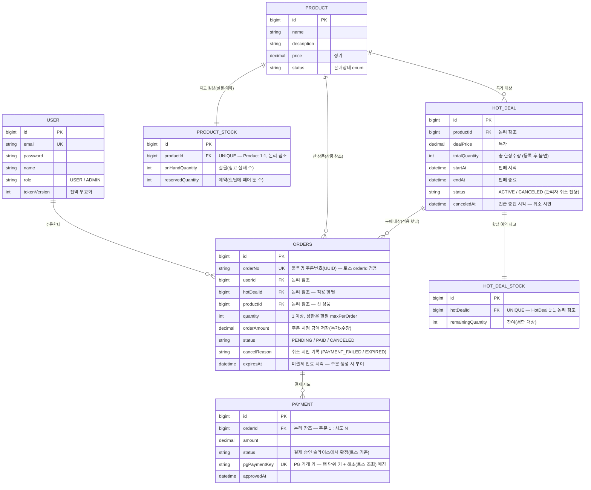

# 데이터 모델 (ERD) — 핫딜 동시성 관점

> 이 문서는 **데이터 모양**만 적는다. **결정의 이유(대안·트레이드오프)는 전부 [ADR](../adr/README.md)** 에 있다.
> 표기: 기술 용어는 첫 등장에 한 줄 풀이를 병기한다. 인증·회원은 구현 완료 — [인증 ADR](../adr/auth.md).

---

## 1. 한눈에 — 엔티티 관계



> - 표기: `PK` = 기본 키 · `UK` = 유니크(같은 값이 두 번 저장될 수 없음) · `FK` = 참조 — **논리적 표기일 뿐, 물리 DDL(실제 테이블 생성 SQL)에는 FK 제약을 걸지 않는다** ([참조 무결성 ADR](../adr/integrity.md)).
> - MySQL 예약어 회피로 주문 테이블명은 `orders`. 위 컬럼은 개략 — 실제 매핑/제약은 마이그레이션에서 확정.

---

## 2. 엔티티 역할

| 엔티티 | 역할 | 핫딜 동시성에서의 위치 |
|---|---|---|
| **User** | 구매자(이미 구현) | 경합 무관 |
| **Product** | 상품 카탈로그(정가·설명) | 핫딜이 참조하는 대상 — 엔티티·마이그레이션은 핫딜과 **함께 생성**. 재고는 이 행이 아니라 **`ProductStock`에 분리**(경합 격리를 상품 레벨로 — [재고 동시성 ADR](../adr/concurrency.md)). 구매는 핫딜 경유라 쓰기 경합 없음 |
| **ProductStock** | 상품 재고 **원본**(실물·예약) | 가용=실물−예약(계산, 저장 안 함). 핫딜 등록이 여기서 **예약**, 결제확정이 실물·예약 차감 — 등록/취소·결제확정(저경합)만 건드려 핫 패스와 분리 ([재고 동시성 ADR](../adr/concurrency.md)) |
| **HotDeal** | 한정 수량·기간 특가 | 선착순 구매가 일어나는 곳. 가격/기간 **메타**만 — 진행/매진 상태값 없음 ([핫딜 ADR 1절](../adr/hotdeal.md)) |
| **HotDealStock** | HotDeal 예약 재고 행 | **동시성 핫스팟**(경합이 한 지점에 집중되는 자리) — 모든 동시 구매가 이 한 행을 차감 |
| **Order** | 구매 1건(회원 × 핫딜) | 산 상품(`product`) + 적용 핫딜(`hot_deal`) 참조 · 주문 시점 금액 저장 · 계정당 1활성주문 유니크 · 불투명 주문번호 · 선점 만료 시각 · 취소 사유 |
| **Payment** | 토스 결제 **시도** 기록 — **행 단위 = paymentKey 1개** | 토스 호출 ↔ DB 트랜잭션 분리 지점. 실패 시도도 행으로 보존 ([결제 ADR 2·4절](../adr/payment.md)) |

---

## 3. 관계 · 카디널리티(1:1, 1:N 같은 대응 개수)

| 관계 | 카디널리티 | 비고 |
|---|---|---|
| User → Order | 1 : N | 같은 핫딜은 살아 있는 주문 1건 ([주문 ADR 4절](../adr/order.md)) |
| Product → ProductStock | 1 : 1 | 재고 원본 분리 — 경합 격리를 상품 레벨로 ([재고 동시성 ADR](../adr/concurrency.md)) |
| Product → HotDeal | 1 : N | 회차(추가 물량 = 새 핫딜) 모델 지원. 판매 기간 겹침은 등록 검증으로 금지 ([핫딜 ADR 3절](../adr/hotdeal.md)) |
| Product → Order | 1 : N | 주문이 산 상품 참조(적용 핫딜은 `hot_deal`) ([재고 동시성 ADR](../adr/concurrency.md)) |
| HotDeal → HotDealStock | 1 : 1 | 핫딜 예약 재고 행 — 경합 격리 ([재고 동시성 ADR](../adr/concurrency.md)) |
| HotDeal → Order | 1 : N | 한 핫딜에 여러 구매 |
| Order → Payment | **1 : N** | 행 단위 = paymentKey(PG 거래 키) 1개 — 재시도 멱등은 토스 `Idempotency-Key`(=paymentKey) 헤더가, 승인 1건 보장은 주문 상태 전이(PENDING→PAID 1회)가 담당 ([결제 ADR 2·7절](../adr/payment.md)) |

---

## 4. 물리 DDL 정책

실제 스키마의 원본은 Flyway 마이그레이션(`V1`~`V6`)이다. 여기에는 **모양을 읽는 데 필요한 것**만 적는다.

- **FK 제약을 걸지 않는다.** 참조는 `*_id` 컬럼으로 두고 인덱스는 조회 경로가 있을 때만 건다 — [참조 무결성 ADR 1절](../adr/integrity.md)
- **금액은 전 컬럼 `DECIMAL(12,0)`**, JPA `BigDecimal`. **시각은 전 컬럼 `DATETIME(6)`**
- **주문번호** `order_no CHAR(36)` — UUID v4, UNIQUE. 토스 주문번호를 겸한다
- **가용 수량(실물 − 예약)은 저장하지 않는다.** 조회 시 계산한다 — [재고 동시성 ADR 2절](../adr/concurrency.md)
- **재고 테이블에 `version` 컬럼이 없다.** 낙관적 락 측정이 끝난 뒤 제거했다 — [벤치마크 RFC 2절](../rfc/concurrency-benchmark.md)

**활성 유니크 — 계정당 살아 있는 주문 1건** ([주문 ADR 4절](../adr/order.md))

```sql
is_active TINYINT GENERATED ALWAYS AS (IF(status IN ('PENDING','PAID'), 1, NULL)) STORED,
UNIQUE KEY uk_orders_active (user_id, hot_deal_id, is_active)
```

- 취소된 주문은 `is_active` 가 NULL 이라 유일성 검사에서 빠진다. 그래서 취소 뒤 재구매가 열린다
- **엔티티에 매핑하지 않는다.** 마이그레이션 DDL 전용이다
- 주문 저장의 유니크 위반은 제약명을 가리지 않고 전부 `ALREADY_PURCHASED` 로 나간다. `order_no` UUID 충돌만 따로 재시도하는 분기는 두지 않았다

**CHECK 제약 9개** — 코드가 뚫려도 데이터가 망가지는 것은 막는다 ([주문 ADR 7절](../adr/order.md))

| 테이블 | 제약 |
|---|---|
| `product_stock` | `on_hand_quantity >= 0` · `reserved_quantity >= 0` · `reserved_quantity <= on_hand_quantity`(가용 음수 방지) |
| `hot_deals` | `total_quantity > 0` · `max_per_order > 0` · `start_at < end_at` |
| `hot_deal_stock` | `remaining_quantity >= 0` — 차감 쿼리의 WHERE 와 겹으로 음수 재고를 막는다 |
| `orders` | `quantity >= 1` · `order_amount >= 0` |

- **인덱스는 만료 처리용 `(status, expires_at)` 하나만 걸었다.** 조회용은 고트래픽 조회 단계에서 정한다
