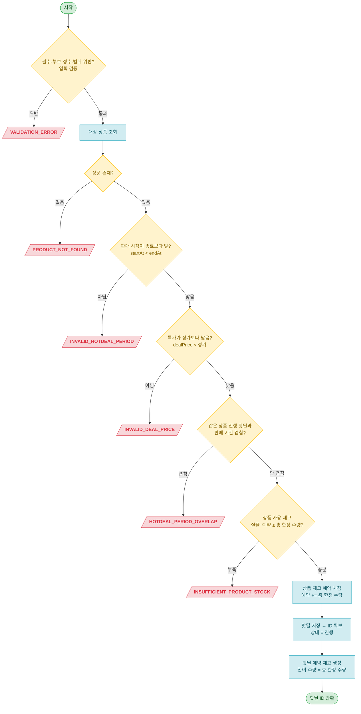

# 핫딜 Admin API 설계 문서

> 공통 정의(엔티티·Enum·응답 형식·ExceptionCode·제약)는 [api-design.md](api-design.md) 참조.

## API 목록 (1개)

| # | Method | Endpoint | 설명 |
|---|--------|----------|------|
| 1 | POST | `/api/admin/hotdeals` | 핫딜 등록 |

---

## 1. 핫딜 등록

```
POST /api/admin/hotdeals
```

> 관리자가 상품 하나에 대해 특가·총 한정 수량·판매 기간을 정해 핫딜을 연다. 등록 시 대상 상품의 재고 원본(`ProductStock`)에서 가용(실물−예약)이 총 한정 수량 이상인지 검사하고 그만큼 **예약을 차감**한 뒤, 핫딜 예약 재고(`HotDealStock` 1:1)를 `잔여 수량 = 총 한정 수량`으로 생성한다. 같은 상품의 ACTIVE 핫딜과 판매 기간이 겹치면 거부한다.
>
> 인증: ADMIN.

**Request**

| 구분 | 파라미터 | 타입 | 필수 | Validation | 설명 |
|------|----------|------|:--:|------------|------|
| Body | productId | Long | O | @NotNull | 대상 상품 ID |
| Body | dealPrice | BigDecimal | O | @NotNull @DecimalMin("1") @Digits(integer=12, fraction=0) | 특가 (1 이상 정수, 정가 미만) |
| Body | totalQuantity | Integer | O | @NotNull @Min(1) @Max(100000) | 총 한정 수량 (1~10만, 등록 후 불변) |
| Body | maxPerOrder | Integer | O | @NotNull @Min(1) @Max(100000) | 1주문 최대 수량 (1~10만) |
| Body | startAt | LocalDateTime | O | @NotNull | 판매 시작 시각 |
| Body | endAt | LocalDateTime | O | @NotNull | 판매 종료 시각 |

**Request Body 예시**

```json
{
  "productId": 10,
  "dealPrice": 9900,
  "totalQuantity": 100,
  "maxPerOrder": 5,
  "startAt": "2026-06-20T07:00:00",
  "endAt": "2026-06-20T09:00:00"
}
```

**검증**

| 검증 항목 | 방식 | 에러코드 |
|-----------|------|----------|
| productId 필수 | @NotNull | VALIDATION_ERROR |
| dealPrice 필수·1 이상·정수 | @NotNull @DecimalMin("1") @Digits(integer=12, fraction=0) | VALIDATION_ERROR |
| totalQuantity 필수·1~10만 | @NotNull @Min(1) @Max(100000) | VALIDATION_ERROR |
| maxPerOrder 필수·1~10만 | @NotNull @Min(1) @Max(100000) | VALIDATION_ERROR |
| startAt·endAt 필수 | @NotNull | VALIDATION_ERROR |
| 대상 상품 존재 여부 | 비즈니스 검증 (productService.getProduct) | PRODUCT_NOT_FOUND |
| 판매 기간 유효성 (startAt < endAt) | 비즈니스 검증 (엔티티 `create()`) | INVALID_HOTDEAL_PERIOD |
| 특가가 정가 미만 (dealPrice < 정가) | 비즈니스 검증 (엔티티 `create()`) | INVALID_DEAL_PRICE |
| 같은 상품 ACTIVE 핫딜과 기간 겹침 | 비즈니스 검증 (Service) | HOTDEAL_PERIOD_OVERLAP |
| 상품 가용 재고 충분 (가용 ≥ 총 한정 수량) | 비즈니스 검증 (productStockService 예약, stock 도메인) | INSUFFICIENT_PRODUCT_STOCK |

> **설계 노트 — maxPerOrder(1주문 최대 수량)**: 1인 구매 제한의 주문당 상한([주문 ADR 5절](../adr/order.md)). 등록 시 핫딜에 저장만 하고, 구매 시 `quantity ≤ maxPerOrder` 검증(`EXCEEDS_PURCHASE_LIMIT`)은 슬라이스1이다. `totalQuantity`와 독립 축이라 교차검증을 두지 않는다 — `maxPerOrder > totalQuantity`여도 구매 차감이 `HotDealStock`(잔여=`totalQuantity`) 기준이라 오버셀 불변식엔 무해([주문 ADR 6절](../adr/order.md)).
>
> **설계 노트 — dealPrice 검증**: 1 이상(`@DecimalMin("1")`) · 정수(`@Digits(fraction=0)` — 원화는 소수점이 없어 `DECIMAL(12,0)`을 입력 단계에서 미러, 미적용 시 소수가 DB에서 조용히 반올림됨) · 정가 미만(엔티티 `create()` → `INVALID_DEAL_PRICE`). 0원·음수·소수점은 입력 단계에서 `VALIDATION_ERROR`(400)로 거른다.
>
> **설계 노트 — startAt에 @Future를 두지 않는 이유**: 관리자가 과거/현재 시각으로도 핫딜을 열 수 있어야 하는 운영 재량을 남긴다(예: 즉시 오픈, 테스트 운영). 시간 도달 = 오픈이므로([ADR-0007 결정1](../adr/0007-hotdeal-state-operations.md)) 미래 강제는 정책으로 굳히지 않는다.
>
> **설계 노트 — 계층 경계(타 도메인 검증·예약)**: 상품 존재 검증과 재고 예약은 서로 다른 타 도메인이다([ADR-0012](../adr/0012-context-map-module-boundaries.md) — `Product`는 product 모듈, `ProductStock`은 stock 모듈). Facade가 **productService**(product)에서 상품을 확보하고, **상품 재고 예약(가용 검사 + 예약 차감)은 stock 도메인의 `productStockService`에 위임**한다. 핫딜 Service가 타 도메인 Repository를 직접 부르면 [service.md](../../.claude/rules/service.md) 위반이라 검증·예약 모두 Facade 경유다. 가용 < 수량이면 `StockExceptionCode.INSUFFICIENT_PRODUCT_STOCK`(409). 기간 겹침 검증만 핫딜 자기 Repository 조회이므로 핫딜 Service 안에서 수행한다.
>
> **설계 노트 — 기간 겹침 경합 수용**: 동시 등록 두 건이 기간 겹침 검증을 같이 통과하는 경합은 관리자 단독 운영 전제로 수용한다([ADR-0007 결정4](../adr/0007-hotdeal-state-operations.md)). 행 잠금·직렬화를 구현하지 않으며, 동시성 테스트도 두지 않는다(순차 등록의 겹침 거부만 검증).

**Response**

```json
{
  "result": true,
  "data": {
    "hotDealId": 42
  }
}
```

**구현 로직**



> **설계 노트 — 저장 순서와 트랜잭션 원자화**: 핫딜 예약 재고(HotDealStock)는 핫딜 ID를 raw 값으로 보유하므로(객체 연관 아님), 만들려면 핫딜의 PK가 먼저 필요하다. 따라서 ① 상품 재고 예약 차감(ProductStock) → ② 핫딜 저장·ID 확보 → ③ 그 ID로 HotDealStock 생성 순서다. 셋은 같은 Facade 트랜잭션 안이라 하나가 실패하면 모두 롤백된다(부분 생성·초과 예약 방지). Facade는 클래스 레벨 트랜잭션 없이 이 메서드에만 쓰기 트랜잭션을 건다([service.md](../../.claude/rules/service.md)).
>
> **설계 노트 — 검증 순서**: 입력 검증(컨트롤러 진입 전) → 상품 존재(Facade) → 엔티티 생성 시 기간 유효성·특가<정가 검증 → 기간 겹침(Service) → 상품 재고 가용 검사·예약(Facade가 productService 위임) 순서다. 엔티티 생성은 메모리상 검증이라 `create()`를 겹침 쿼리보다 **먼저** 호출해 잘못된 입력에 무의미한 DB 쿼리가 도는 것을 막고, 예약 차감(쓰기)은 모든 거절 사유를 통과한 맨 끝에 둔다.

**엔티티 메서드 설계 (HotDeal)**

정적 팩토리 `create(CreateHotDealRequest, Product)`에서 빌더 조립과 기간 유효성·특가<정가 검증을 캡슐화한다([entity.md](../../.claude/rules/entity.md)). 아래는 구현 가이드용 의사 코드다.

```java
public static HotDeal create(CreateHotDealRequest request, Product product) {
    validatePeriod(request.startAt(), request.endAt());
    validateDealPrice(request.dealPrice(), product.getPrice());
    return HotDeal.builder()
        .product(product)
        .dealPrice(request.dealPrice())
        .totalQuantity(request.totalQuantity())
        .maxPerOrder(request.maxPerOrder())
        .startAt(request.startAt())
        .endAt(request.endAt())
        .status(HotDealStatus.ACTIVE)
        .build();
}

private static void validatePeriod(LocalDateTime startAt, LocalDateTime endAt) {
    if (!startAt.isBefore(endAt)) {
        throw new DomainException(INVALID_HOTDEAL_PERIOD);
    }
}

private static void validateDealPrice(BigDecimal dealPrice, BigDecimal listPrice) {
    if (dealPrice.compareTo(listPrice) >= 0) {
        throw new DomainException(INVALID_DEAL_PRICE);
    }
}
```

**쿼리 설계**

기간 겹침은 조건이 3개(productId + 두 시각 비교 + status)라 가독성을 위해 `@Query` JPQL text block을 사용한다([repository.md](../../.claude/rules/repository.md)). 메서드 존재는 TDD GREEN 단계에서 정당화한다.

```java
// HotDealRepository — 겹침 판정: s1 < e2 AND s2 < e1, ACTIVE 만
@Query("""
    SELECT COUNT(h) > 0 FROM HotDeal h
    WHERE h.product = :product
      AND h.status = 'ACTIVE'
      AND h.startAt < :endAt
      AND :startAt < h.endAt
""")
boolean existsOverlappingActiveHotDeal(@Param("product") Product product,
                                       @Param("startAt") LocalDateTime startAt,
                                       @Param("endAt") LocalDateTime endAt);
```

> **설계 노트 — 판정식 해설**: 기존 핫딜 `[h.startAt, h.endAt]`과 신규 `[startAt, endAt]`이 겹치려면 `h.startAt < endAt`(기존 시작이 신규 끝보다 앞)이고 `startAt < h.endAt`(신규 시작이 기존 끝보다 앞)이다. 모두 strict `<`이므로 끝과 시작이 맞물리는 경우(`h.endAt == startAt`)는 겹침이 아니다. 인덱스 `idx_hot_deals_product_id`가 productId 조회를 받쳐 준다(범위 비교는 인덱스 스캔 후 필터 — 관리자 단독 등록이라 트래픽 무관).

**테스트 리스트**

> vertical TDD 사이클로 한 줄씩 누적한다([commit-checkpoint.md](../../.claude/rules/commit-checkpoint.md)). 설계 단계는 헤더만 둔다(placeholder 행 금지).

| # | 테스트 케이스 | 시나리오 | 상태 | 작성일 |
|---|---------------|----------|------|--------|
| 1 | `createHotDealWithStock` | 정상 등록 시 상품재고 예약(reserved 차감) + 핫딜·핫딜재고 생성, hotDealId 반환 | ✅ Pass | 2026-06-19 |
| 2 | `insufficientProductStock` | 상품 가용(실물−예약) < 총 한정 수량이면 INSUFFICIENT_PRODUCT_STOCK(409) + 핫딜·핫딜재고 미생성(롤백) | ✅ Pass | 2026-06-19 |
| 3 | `reserveExactlyAvailableStock` | 가용 == 총 한정 수량이면 예약 성공 + 예약 후 가용 0 (off-by-one 상한 명세) | ✅ Pass | 2026-06-19 |
| 4 | `overlappingActiveHotDeal` | 같은 상품 ACTIVE 핫딜과 판매기간 겹치면 HOTDEAL_PERIOD_OVERLAP(409), 두 번째 미생성 | ✅ Pass | 2026-06-19 |
| 5 | `invalidPeriod` | 판매 시작 ≥ 종료면 INVALID_HOTDEAL_PERIOD(400), 핫딜 미생성 | ✅ Pass | 2026-06-19 |
| 6 | `invalidDealPrice` | 특가 ≥ 정가면 INVALID_DEAL_PRICE(400), 핫딜 미생성 | ✅ Pass | 2026-06-19 |
| 7 | `productNotFound` | 존재하지 않는 상품으로 등록 시 PRODUCT_NOT_FOUND(404), 핫딜 미생성 | ✅ Pass | 2026-06-19 |
| 8 | `validationError` | 총 한정 수량 < 1이면 VALIDATION_ERROR(400), 핫딜 미생성 | ✅ Pass | 2026-06-19 |
| 9 | `stockNotFound` | 상품 재고 정보(ProductStock)가 없으면 STOCK_NOT_FOUND(404), 핫딜 미생성 | ✅ Pass | 2026-06-19 |
| 10 | `concurrentReserveNeverOversells` | 같은 상품에 동시 N등록이 몰려도 예약이 가용을 못 넘음(오버셀 0)·정확 소진·성공 수 = 가용÷수량 — 원자적 조건부 UPDATE([재고 동시성 ADR 4절](../adr/concurrency.md)) | ✅ Pass | 2026-06-20 |
| 11 | `storeMaxPerOrder` | 등록 시 입력한 maxPerOrder(1주문 최대 수량)가 그대로 저장 | ✅ Pass | 2026-06-22 |
| 12 | `maxPerOrderBelowMin` | maxPerOrder < 1이면 VALIDATION_ERROR(400), 핫딜 미생성 | ✅ Pass | 2026-06-22 |
| 13 | `maxPerOrderMissing` | maxPerOrder 누락이면 VALIDATION_ERROR(400), 핫딜 미생성 | ✅ Pass | 2026-06-22 |
| 14 | `maxPerOrderExceedsMax` | maxPerOrder > 10만이면 VALIDATION_ERROR(400), 핫딜 미생성 | ✅ Pass | 2026-06-22 |

> **재고 동시성 ADR 반영 노트**: #1~#3 으로 재고 동시성 ADR 등록 재고(예약 차감 · 가용 부족 거부 · 경계 상한)가 반영 완료됐다(2026-06-19). 기간 겹침·기간 유효성·특가·상품 미존재·Bean Validation 은 작업2 범위 밖으로 후속 사이클에서 다룬다.
>
> **재고 동시성 ADR 4절 반영 노트(2026-06-20)**: #10 으로 ProductStock 예약 동시성이 낙관락 → **원자적 조건부 UPDATE** 로 전환됐다(`version` 칼럼 제거 — 운영 미적용 초기라 V2 스키마 직접 수정 · 재시도 없이 영향 행 수로 판단). 같은 상품에 다른 기간 핫딜이 동시 등록돼도 예약이 가용을 못 넘는다(오버셀 0). 기간 겹침 경합은 여전히 수용(ADR-0007 결정4) — #10 은 **재고 예약 경합**만 검증(기간 겹침 동시성 아님).
