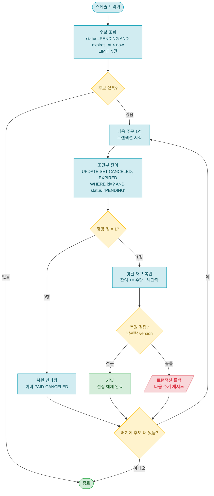

# 주문(order) System API 설계 문서 — 미결제 주문 만료

> 공통 정의(엔티티·Enum·응답 형식·ExceptionCode·제약)는 [api-design.md](api-design.md) 참조.
> 이 문서는 **시스템 스케줄러**가 수행하는 미결제 주문 만료(슬라이스 2)를 다룬다 — HTTP 엔드포인트가 없는 백그라운드 작업이다.
>
> **용어 — sweep(쓸어 담기)**: 주기적으로 데이터베이스를 한 번씩 훑어, 조건에 맞는 행(여기선 만료된 주문)을 찾아 처리하는 작업을 말한다. 이하 "만료 sweep".

## 작업 목록 (1개)

| # | 트리거 | 작업 | 설명 |
|---|--------|------|------|
| 1 | `@Scheduled`(주기) | 미결제 주문 만료 sweep | `expiresAt` 지난 PENDING 주문을 CANCELED(EXPIRED)로 전이하고 핫딜 재고를 복원 |

---

## 1. 미결제 주문 만료 sweep

```
@Scheduled (주기 실행 · HTTP 엔드포인트 없음)
```

> 결제 제한시간(`expiresAt`)이 지나도록 미결제인 PENDING 주문을 자동 취소하고, 선점했던 핫딜 재고를 풀어 다른 구매자가 살 수 있게 한다. 사용자 요청이 없는 **시간 트리거 작업**이라 스케줄러가 주기적으로 처리한다. 이 시점부터 "선점 → 해제"가 닫혀 시스템이 상시 자기 완결한다([가설 9절](../design/hotdeal-purchase-hypothesis.md)).
>
> 스케줄러는 외부 트리거를 받는 진입점(인바운드 어댑터)이라 컨트롤러와 동급이고, **Facade를 거친다**(Service 직접 호출 금지 — [service.md](../../.claude/rules/service.md)).

**동작**

1. **후보 조회 — 한 사이클에 정해진 개수만(LIMIT)**: `status = PENDING AND expires_at < now`인 주문을 **한 번에 N건(예: 500)** 만 읽는다. 한 번에 전부 가져오지 않으므로, 만료 주문이 아무리 많아도(예: 백만 건) **한 사이클이 백만 번 도는 일은 없다** — 남은 건 다음 주기가 이어서 처리한다(밀린 양을 여러 주기로 나눠 처리). `idx_orders_status_expires_at(status, expires_at)` 인덱스를 탄다(스키마 완비, 마이그레이션 변경 없음).
2. **주문 1건 = 트랜잭션 1개**: 후보를 건별로 Facade에 넘겨 각자 독립 트랜잭션에서 처리한다. 한 건이 실패해도 나머지가 롤백되지 않고, 각 주문·재고 행을 **짧게만** 잠가 실시간 구매와의 경합을 줄인다([가설 8절](../design/hotdeal-purchase-hypothesis.md)).
3. **조건부 전이 + 게이트된 복원**: `UPDATE … SET status=CANCELED, cancel_reason=EXPIRED WHERE id=? AND status='PENDING'`의 **영향 행이 1일 때만** 같은 트랜잭션에서 재고를 복원한다(복원 정확히 1회 = restore-once 불변식 — [ADR-0004 결정3](../adr/0004-stock-reservation-lifecycle.md)). 잠금 순서는 "주문 → 재고"로 통일한다([ADR-0009 결정4](../adr/0009-stock-concurrency-design.md)).

> **설계 노트 — 왜 건별 처리이고, 대량은 어떻게 하나**: 복원을 '내가 방금 취소시킨 주문'에만 정확히 1회 하려면, 전이의 **영향 행 수(0이냐 1이냐)를 주문 건마다** 봐야 한다 — 그래서 건별 루프다(1이면 복원, 0이면 이미 결제·취소된 것이라 건너뜀). 루프 횟수는 곧 한 사이클의 후보 수인데, 그 수는 **LIMIT으로 묶여 있어** 백만 건이라도 한 사이클에 다 돌지 않고 여러 주기로 나뉜다. 만약 한 주기 처리량으로도 인입을 못 따라갈 만큼 대량이면, **청크 배치**(예: 500건을 한 트랜잭션에서 전이하고, 핫딜별로 복원 수량을 합산해 재고 UPDATE를 '핫딜 수'만큼만 실행)로 트랜잭션 수를 줄이는 최적화가 있다. 단 청크는 재고 행 잠금을 더 오래 쥐어 실시간 구매와 경합이 커지고, **복원 합산(한 번에 더하기)은 재고 차감 방식과 한 묶음**이라(차감이 낙관락이면 합산 결과가 어긋남) 차감 동시성 방식을 정하는 [ADR-0009](../adr/0009-stock-concurrency-design.md)에서 **함께** 측정·결정한다(잠금 없이 시작과 같은 '측정 후' 기조). 참고로 핫딜 재고는 한정 수량이라, 만료 PENDING 주문 수도 그 수량 안팎으로 묶이는 게 보통이다.

**슬라이스 2 확정 결정** ([ADR-0004 보류 해소](../adr/0004-stock-reservation-lifecycle.md))

| 항목 | 결정 | 근거 |
|------|------|------|
| 만료 방식 | **DB sweep 스케줄러**(`@Scheduled`) | Redis 키 TTL은 만료 통보(키 만료 알림)가 재시작 유실·전달 비보장이라 정확성 경로엔 백업 sweep이 또 필요 → 방식은 어차피 sweep. [리서치 9.2절](../design/research-flash-sale.md) |
| 결제 제한시간 | **`PT10M` 확정** (`order.payment-timeout`) | 리서치 권장대역 5~15분 내, 고객 고지 제한시간. [ADR-0004](../adr/0004-stock-reservation-lifecycle.md) |
| sweep 판정 기준 | **`order.expiresAt`만** (핫딜 `endAt` 무관) | 진입 고객은 자기 결제창 시간까지 보호("판매 종료는 새 주문에만"). 판매종료·관리자 중단 ↔ 결제 차단은 슬라이스3 결제 게이트. [ADR-0007](../adr/0007-hotdeal-state-operations.md) |
| 다중 서버 중복 | **잠금 없이 시작** | 여러 서버가 동시 sweep해도 **HotDealStock `@Version`(슬라이스1 낙관락)이 복원 1회를 보장**(두 번째 복원이 version 충돌→롤백, 동시성 테스트로 증명). redundant sweep 비용은 부하 측정 후 필요 시 **Redis ShedLock**(정확성 아닌 **최적화** — @Version이 정확성 보장)으로 추가. 스케일아웃 트레이드오프 인지. [ADR-0006](../adr/0006-correctness-invariants-defense-layers.md) |

> **설계 노트 — sweep이 조금 늦어도 안전한 이유**: sweep은 주기적으로 돌므로 `expiresAt`(만료 시각)과 실제 CANCELED 사이에 시간 차(갭)가 생긴다. 하지만 이 갭이 늦추는 건 **재고를 다시 풀어주는 시점**뿐이고(10분 창에 수십 초 더라 미미), 정확성과는 무관하다. '이 주문 지금 결제할 수 있나?'처럼 **즉시 정확해야 하는 판정**은, 만료를 sweep이 처리하길 기다리지 않고 **결제 요청이 들어온 바로 그 순간에** `expiresAt`를 직접 확인해서 막는다(슬라이스3 결제 게이트). 그래서 sweep이 늦게 취소하더라도 "만료됐는데 결제되는" 창은 생기지 않는다. 정리하면 — **즉시 정확해야 하는 판정은 요청이 들어온 그 순간에**, **조금 늦어도 되는 재고 회수는 주기 sweep에** 나눠 맡긴 설계다.

**불변식 / 방어**

| 불변식 | 방어 | 비고 |
|--------|------|------|
| **복원 정확히 1회** (restore-once) | **슬라이스2(sweep↔sweep)**: HotDealStock `@Version` 충돌→롤백 / **슬라이스3(sweep↔결제)**: 조건부 전이 `WHERE status='PENDING'` 영향 행 1 게이트 | 슬라이스2는 동시성 테스트로 증명(`version=1`). 주문엔 @Version이 없어 sweep↔결제는 게이트 필요 |
| 오버셀 0 + 정합 | 정합 검증식 `총 수량 = 남은 재고 + 살아있는 주문 수량 합` | 백스톱 — 오버복원 탐지 ([ADR-0006](../adr/0006-correctness-invariants-defense-layers.md) · [가설 4절](../design/hotdeal-purchase-hypothesis.md)) |

> **설계 노트 — 슬라이스2 restore-once는 @Version, 게이트는 슬라이스3**: 슬라이스2의 동시 sweep(같은 주문을 여러 서버가 취소)은 둘 다 **HotDealStock을 복원**하므로, 슬라이스1의 `@Version`(낙관락)이 두 번째 복원을 충돌→롤백시켜 **복원 1회**를 보장한다 — 동시성 테스트가 `version=1` + `ObjectOptimisticLockingFailureException`으로 증명. 그래서 슬라이스2엔 주문 쪽 `affected==1` 게이트가 필요 없다. **그 게이트는 슬라이스3 sweep↔결제에서 필요**해진다: 같은 **주문**에서 취소(만료) vs 결제(PAID)가 부딪히는데 **주문엔 @Version이 없어서**, `WHERE status='PENDING'` 게이트가 있어야 "결제됐는데 만료로 취소"를 막는다. 그 경합은 **서버 1대 dev/test는 통과·운영에서만 조용히 터지는** 종류라 슬라이스3에서 동시성 테스트로 못 박는다.

**새 ExceptionCode**

없음. 백그라운드 작업이라 사용자에게 직접 응답하지 않고, 재고 복원이 낙관락 경합으로 실패하면 트랜잭션을 롤백해 **다음 주기에 다시 시도**한다(만료 = 다음 주기 재시도 — [가설 8절](../design/hotdeal-purchase-hypothesis.md)).

**테스트 리스트**

> vertical TDD 사이클로 한 줄씩 누적한다([commit-checkpoint.md](../../.claude/rules/commit-checkpoint.md)). 설계 단계는 헤더만 둔다(placeholder 행 금지).

| # | 테스트 케이스 | 시나리오 | 상태 | 작성일 |
|---|---------------|----------|------|--------|
| 1 | `expireOverdueOrder` | 결제 제한시간 지난 PENDING → sweep 시 CANCELED(EXPIRED) + 핫딜 재고 복원 | ✅ Pass | 2026-06-23 |
| 2 | `notYetExpiredOrderIsPreserved` | 만료 안 된 PENDING은 sweep해도 PENDING 유지 + 재고 불변 | ✅ Pass | 2026-06-23 |
| 3 | `concurrentSweepRestoresStockOnce` | 같은 만료 주문 동시 N-sweep → 재고 1회만 복원(@Version, version=1) + 낙관락 충돌 발생 | ✅ Pass | 2026-06-23 |

**구현 로직**



> **설계 노트 — 계층 경계**: `OrderExpiryScheduler`(시간 트리거 진입점, `@Scheduled`)가 후보를 읽어 건별로 `OrderExpiryFacade`를 호출하고, Facade가 order Service(조건부 전이)와 stock Service(재고 복원)를 조합한다. 스케줄러는 컨트롤러처럼 **Facade만** 호출하고, 건별 `@Transactional`은 Facade 메서드에 둔다(주문 1건 = 트랜잭션 1). `@Scheduled`를 켜려면 `@EnableScheduling`을 전역 설정(`global/config`)에 추가한다(슬라이스2 GREEN). 새 마이그레이션은 없다.

**엔티티 / 도메인 메서드 설계**

`HotDealStock.restore`는 차감(`deduct`)의 거울로 잔여를 되돌린다([entity.md](../../.claude/rules/entity.md)). 전이는 엔티티 메서드가 아니라 **조건부 UPDATE**(아래 쿼리)로 원자 처리한다. 아래는 구현 가이드용 의사 코드이며, 메서드 존재는 TDD GREEN에서 정당화한다.

```java
// HotDealStock — 복원 도메인 메서드 (deduct 의 거울)
public void restore(int quantity) {
    remainingQuantity += quantity;
}
```

**쿼리 설계**

만료 후보 조회는 상태 + 시각 범위라 의미를 명명하고(인덱스 활용), 복원에 필요한 값만 투영해 불필요한 연관 로딩을 피한다. 전이는 "확인과 쓰기가 한 문장"인 조건부 UPDATE로 한다([repository.md](../../.claude/rules/repository.md)).

```java
// OrderRepository — 만료 후보 (PENDING + 제한시각 경과, idx_orders_status_expires_at)
//   복원에 필요한 id·hotDealId·quantity 만 투영 (엔티티 전체·연관 로딩 회피)
@Query("""
    SELECT new ...order.dto.ExpiredOrderView(o.id, o.hotDeal.id, o.quantity)
    FROM Order o
    WHERE o.status = 'PENDING'
      AND o.expiresAt < :now
""")
List<ExpiredOrderView> findExpiredPending(@Param("now") LocalDateTime now, Pageable limit);

// OrderRepository — 조건부 만료 전이 (영향 행 수 반환 = restore-once 게이트)
@Modifying
@Query("""
    UPDATE Order o
    SET o.status = 'CANCELED', o.cancelReason = 'EXPIRED'
    WHERE o.id = :orderId AND o.status = 'PENDING'
""")
int markExpired(@Param("orderId") Long orderId);

// HotDealStockRepository — 복원 위해 행을 로드 (낙관락 version 추적, 기존 메서드 재사용)
Optional<HotDealStock> findByHotDealId(Long hotDealId);
```

> **설계 노트 — 일괄 UPDATE와 낙관락 복원을 한 트랜잭션에서**: `markExpired`는 영속성 컨텍스트(JPA가 객체를 추적하는 메모리 공간)를 거치지 않는 일괄 UPDATE라 빠르지만, 같은 주문을 다시 읽지 않으므로 값이 어긋날 일이 없다. 재고 복원은 `findByHotDealId`로 `HotDealStock`을 영속성 컨텍스트에 올려 `restore`로 바꾸고, 커밋할 때 DB에 반영하며 version을 비교한다(낙관락). 둘이 한 트랜잭션이라, 복원이 낙관락 충돌로 실패하면 `markExpired`까지 함께 롤백돼 주문이 PENDING으로 남고 다음 주기가 다시 시도한다(전이·복원 원자성).
