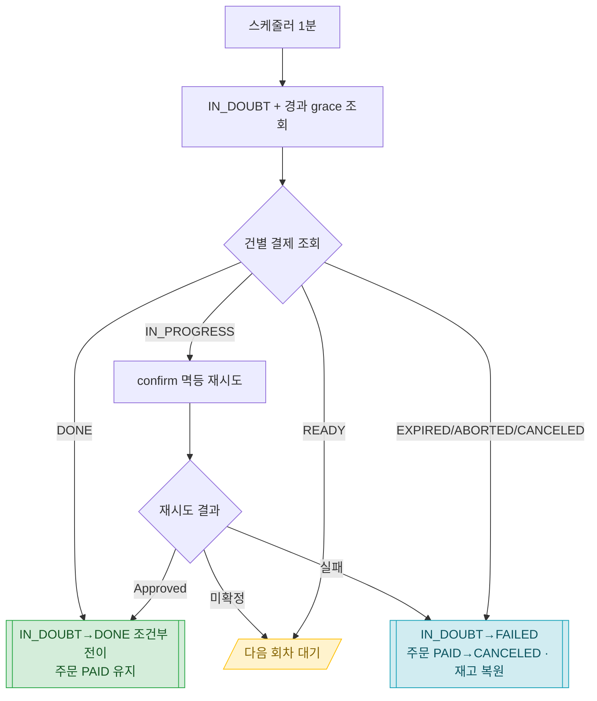

# 결제 시스템 설계 (Phase B2) — IN_DOUBT 해소

> **해소(resolution)**: 미확정(IN_DOUBT) 결제를 토스에 물어봐 실제 상태(성공/실패)로 **최종 확정**하는 것. (회계 용어 "대사"를 풀어 쓴 표현 — 우리가 하는 건 미확정을 확정으로 바꾸는 것이다.)

> 공통 정의(엔티티·Enum·응답 형식·ExceptionCode·제약)는 [api-design.md](api-design.md) 참조. 유저 결제 승인 흐름은 [api-design-user.md](api-design-user.md).

## 개요

- **배경**: B1에서 confirm 응답이 타임아웃·유실되면 `IN_DOUBT`(결과 미확정)를 남기고 주문은 PAID로 **보존**한다(돈 나갔을 수 있어 롤백 금지). 이 미확정을 **확정**하는 게 B2다.
- **목적(B2 범위)**: **스케줄러가 IN_DOUBT 결제를 주기적으로 결제 조회해 확정하는 해소(polling)**. + IN_PROGRESS(우리 confirm 미완성)는 **멱등 재시도로 매출 복구**.
- **제외(후속)**: **웹훅**(실시간 해소 최적화) — 유실 가능(트래픽·방화벽·다운)해서 정합 backbone이 못 되고, 해소가 보장 backbone이라 **해소를 먼저** 둔다. 웹훅은 그 위의 속도 옵션으로 나중에. **앱 밖 사후 취소/환불/분쟁 반영**(별도 환불 기능)도 제외.

> **왜 웹훅이 아니라 해소가 먼저인가**: 웹훅은 IN_DOUBT을 일으키는 상황(서버 부하·타임아웃)에서 같이 유실될 수 있어, 웹훅만 믿으면 "놓친 IN_DOUBT 영영 미해소" 구멍이 남는다. 스케줄러 폴링은 능동 조회라 놓칠 게 없다. IN_DOUBT은 드물어 폴링 대상이 대부분 0건이라 비용도 낮고, 기존 order 만료 스케줄러와 같은 패턴이라 추가 부담이 작다.

## 변경 이력

| 버전 | 날짜 | 내용 |
|---|---|---|
| v0.2 | 2026-07-02 | B2 범위 재정의 — 웹훅 → **해소 스케줄러**(결제 조회 폴링)로 전환. IN_PROGRESS는 멱등 재시도로 매출 복구. 웹훅은 후속 최적화로 분리 |
| v0.1 | 2026-07-01 | (초안 — 웹훅 수신 설계. v0.2에서 해소 우선으로 대체) |

## 알려진 제약 (확정 주체는 우리가 아니라 토스)

- **10분 확정은 토스가 한다**: 결제 인증 후 10분 내 confirm이 성립 안 되면 토스가 자동으로 `IN_PROGRESS → EXPIRED`로 바꾼다([코어 API](https://docs.tosspayments.com/reference)). 우리가 "10분 타이머"로 확정하는 게 아니라, **토스가 확정한 상태를 결제 조회로 읽는다**.
- **만료돼도 조회된다**: `EXPIRED`가 돼도 `paymentKey`로 결제 조회 가능(NOT_FOUND 아님, EXPIRED 상태의 Payment 반환). 그래서 폴링이 항상 최종 상태를 읽을 수 있다.
- **보장선**: `IN_PROGRESS`는 영원히 안 남는다 — 토스가 늦어도 10분이면 `DONE` 또는 `EXPIRED`로 만든다. 따라서 스케줄러가 계속 폴링하면 **모든 IN_DOUBT은 최대 10분 안에 확정**된다(보통 1~2분).

## 해소 동작

**스케줄러**(`@Scheduled`, 예: **1분마다**) 매 회차:

1. `IN_DOUBT` 결제 중 **생성 후 grace(예: 1분) 경과**한 것을 조회한다(방금 생긴 건 토스가 아직 처리 중일 수 있어 헛조회 방지).
2. 각 건을 **결제 조회**(`GET /v1/payments/{paymentKey}`)해 실제 status로 분기.

| 결제 조회 status | 의미 | 우리 처리 |
|---|---|---|
| `DONE` | 승인 완료(돈 나감) — confirm이 실제론 성공했고 응답만 유실 | Payment `IN_DOUBT→DONE` 조건부 전이. 주문 PAID·재고 유지 |
| `IN_PROGRESS` | **인증은 됐는데 우리 confirm이 미완성**(돈 안 나감) — 고객은 사려던 상태 | **confirm 멱등 재시도로 완성 시도**(매출 복구). 성공→DONE, 또 미확정→다음 회차, 실패→아래 실패 처리 |
| `EXPIRED` / `ABORTED` / `CANCELED` | 실패·만료 확정(돈 안 나감) | Payment `IN_DOUBT→FAILED` + 주문 `PAID→CANCELED` + **재고 복원**(`restoreSale`) |
| `READY` | 인증 전(비정상 — 우리 IN_DOUBT과 안 맞음) | 변경 없음, 다음 회차/로깅 |

> **설계 노트 — IN_PROGRESS는 "실패"가 아니라 "우리가 마무리 못 한 매출"**: IN_PROGRESS로 남은 건 고객이 인증까지 다 했는데 우리 confirm이 안 들어간(또는 미완성) **우리 쪽 실패**다 — 카드 거절이 아니다. 그래서 만료로 죽이기 전에 **confirm을 멱등 재시도**(멱등키=paymentKey)해 고객이 원한 결제를 **완성**시킨다. 토스가 타임아웃 시 권장한 "멱등 재시도"가 정확히 이 경우다. 재시도는 **10분 창이 자연 상한**(그 뒤엔 EXPIRED라 재시도 대상이 아님)이라 별도 횟수 카운터가 없어도 폭주하지 않는다.

> **설계 노트 — 실패 해소는 PAID→CANCELED(비동기라 재시도 불가)**: B1 동기 보상은 PENDING으로 되돌리지만(유저 즉시 재시도), 해소는 수 분 뒤 비동기 + paymentKey 죽음이라 PENDING이면 좀비 주문이 된다. 그래서 실패 확정은 **CANCELED(종료)** + 재고 복원. 재고는 판매 성립 안 했으니 시점 무관 복원.

> **설계 노트 — 고객 노출 상태는 "확인 중"**: IN_DOUBT은 고객에게 "결제 완료"로 보이면 안 된다(나중에 실패 확정 시 "완료→취소" 민원). Payment가 IN_DOUBT면 주문이 내부적으로 PAID여도 **고객 화면엔 "결제 확인 중"** 으로 노출한다(가상계좌 "입금 대기"와 같은 결). 해소가 확정하면 성공/실패로 갱신 → "완료→취소" 휘둘림이 없다. (이 표현 매핑은 주문 조회 응답의 파생 상태 — 별도 작은 조각.)

## 처리 흐름



## 테스트 리스트

| # | 테스트 케이스 | 시나리오 | 상태 | 작성일 |
|---|---|---|---|---|

## 계층

| 층 | 클래스 | 책임 |
|---|---|---|
| 스케줄러 | `PaymentResolutionScheduler` | `@Scheduled` — IN_DOUBT 목록 조회 후 건별 Facade 위임(로직 0). order 만료 스케줄러와 같은 패턴 |
| Facade | `PaymentResolutionFacade` | 건별: 결제 조회 → status 분기 → 확정/재시도/실패 조합(Payment·Order·Stock). 메서드 `@Transactional` |
| Service | `CommonPaymentService`(전이)·`CommonOrderService`(PAID→CANCELED)·`ProductStockService`(restoreSale) | 자기 도메인 조건부 전이 |
| 게이트웨이 | `PaymentGatewayClient.getPayment(paymentKey)`(신설) + `confirm(...)`(B1 재사용) → `TossPaymentClient` → `TossHttpClient` | 결제 조회 GET 신설, IN_PROGRESS 재시도는 기존 confirm 재사용 |

### 결제 조회 게이트웨이 규약 (신설)

B1의 3층(계약/어댑터/전송)을 확장한다.

```java
// 계약 — 실제 상태 재확인
PgPayment getPayment(String paymentKey);

// 결과 — 토스가 확정한 상태 최소 식별자
record PgPayment(PgPaymentStatus status, BigDecimal totalAmount, LocalDateTime approvedAt) {}
enum PgPaymentStatus { DONE, IN_PROGRESS, EXPIRED, ABORTED, CANCELED, READY, WAITING_FOR_DEPOSIT }

// 전송 — @HttpExchange
@GetExchange("/v1/payments/{paymentKey}")
TossConfirmResponse getPayment(@PathVariable String paymentKey);   // 조회 응답은 confirm과 같은 Payment 객체라 재사용
```

## 쿼리 설계

```java
// IN_DOUBT + 생성 후 grace 경과 (조건부 조회, 페이지/배치)
@Query("""
    SELECT p FROM Payment p
    WHERE p.status = 'IN_DOUBT' AND p.createdAt <= :threshold
""")
List<Payment> findInDoubtBefore(@Param("threshold") LocalDateTime threshold);
```

## 후속 (B3+)

- **웹훅**: 해소보다 **빠른** 실시간 해소가 필요해지면 `PAYMENT_STATUS_CHANGED` 웹훅을 붙여 같은 확정 로직(결제 조회 재확인 → status 분기)을 재사용한다. 웹훅은 **해소를 대체하지 않고**(유실 가능) 그 위의 최적화. 검증은 서명이 아니라 결제 조회 재확인.
- **넓은 해소**: "주문 PAID + Payment 없음"(예상 못한 예외 잔여) 같은 다른 drift까지 잡는 일 단위 PG 전체 대조(배민식)는 재무급 안전망으로 더 나중.
- **앱 밖 사후 변경**: CS·카드사 취소, 분쟁(chargeback)은 환불/취소 기능과 함께 웹훅으로 반영.
