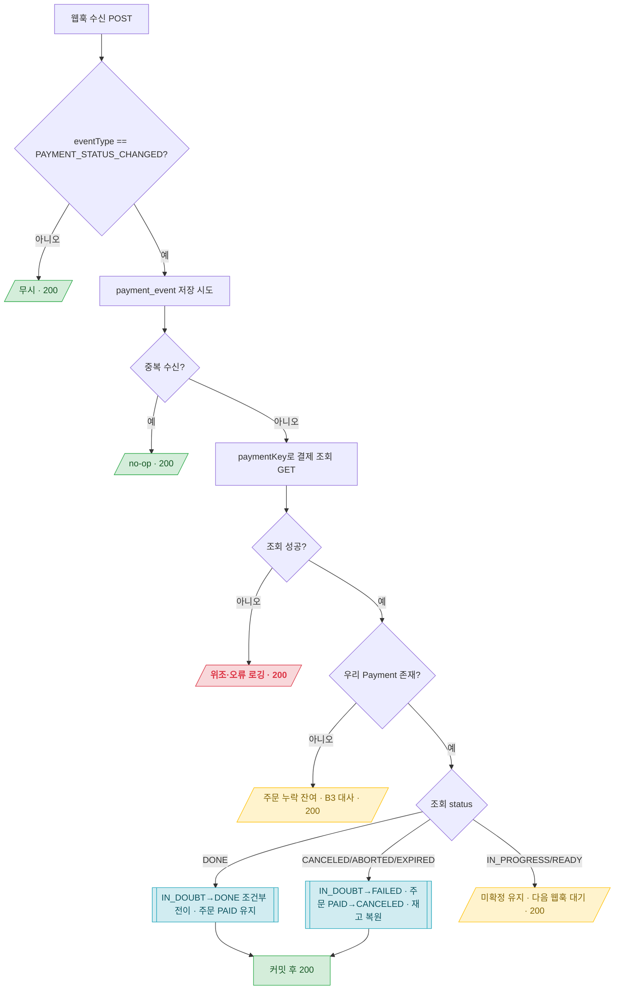

# 결제 시스템 인바운드 설계 (Phase B2) — 토스 웹훅

> 공통 정의(엔티티·Enum·응답 형식·ExceptionCode·제약)는 [api-design.md](api-design.md) 참조. 유저 결제 승인 흐름은 [api-design-user.md](api-design-user.md).

## 개요

- **배경**: B1에서 confirm 응답이 타임아웃·유실되면 `IN_DOUBT`(결과 미확정) Payment를 남기고 주문은 PAID로 **보존**한다(돈 나갔을 수 있어 롤백 금지). 이 미확정을 **누가·언제 DONE/FAILED로 확정하는가**가 B2다.
- **목적(B2 범위)**: 토스 **웹훅 수신 → 결제 조회로 실제 상태 재확인 → `IN_DOUBT` 해소**(PAID 확정 또는 실패 보상). 멱등 처리.
- **제외(B3)**: **배치 대사(reconciliation)** — 웹훅이 아예 오지 않은 미확정(상태 미변화·웹훅 유실)과 "주문 PAID + Payment 없음" 잔여는 주기적 배치가 스캔·확정한다. B2는 **웹훅이 오는 케이스만** 해소하고, 안 오는 케이스는 B3가 받는다.

> **B2와 B3의 경계**: 웹훅은 결제 **상태가 바뀔 때만** 발화한다([토스 웹훅 규격](https://docs.tosspayments.com/reference/using-api/webhook-events)). confirm이 성공(DONE)하면 상태 변화라 웹훅이 오지만, confirm이 조용히 실패(상태 미변화)한 미확정엔 웹훅이 안 올 수 있다. 그 공백을 B3 대사가 메운다 — B2만으로 완결되지 않음을 전제한다.

## 변경 이력

| 버전 | 날짜 | 내용 |
|---|---|---|
| v0.1 | 2026-07-01 | Phase B2 초안 — 토스 웹훅 수신(`PAYMENT_STATUS_CHANGED`) + 결제 조회 재확인 검증 + `IN_DOUBT` 해소(DONE 확정/실패 보상) + `payment_event` 멱등. 대사 배치는 B3 분리 |

## 알려진 제약

- **웹훅 검증은 서명이 아니라 결제 조회 재확인**: 토스는 일반 결제 웹훅(`PAYMENT_STATUS_CHANGED`)용 서명 헤더를 문서에 명시하지 않는다(HMAC `tosspayments-webhook-signature`는 **지급대행 전용**). 따라서 **웹훅 body를 신뢰하지 않고**, 담긴 `paymentKey`로 **결제 조회 API(GET)** 를 호출해 실제 상태를 우리 시크릿키로 인증된 채널에서 재확인한다. 위조 방지 + 확정 상태 획득을 겸한다.
- **10초 이내 200 응답**: 미응답 시 최대 7회 재전송(3일 19시간, 지수 백오프)([웹훅 연결하기](https://docs.tosspayments.com/guides/v2/webhook)). 재전송이 있으므로 **핸들러 멱등 필수**.
- **웹훅은 hot path 아님**: 유저 confirm 경로와 별개의 비동기 인바운드라, 결제 조회 1회 추가가 유저 요청 스레드를 잡지 않는다(B1에서 confirm 경로에 동기 조회를 피한 것과 상충하지 않음).

## API 목록

| # | Method | URL | 호출자 | 설명 |
|---|---|---|---|---|
| 1 | POST | `/api/payments/toss/webhook` | 토스(시스템) | 결제 상태 변화 웹훅 수신 → IN_DOUBT 해소 |

---

## 1. 토스 결제 웹훅 수신

### Endpoint
`POST /api/payments/toss/webhook` — 인증 없음(`permitAll`). 발신자 신뢰는 서명이 아니라 **결제 조회 재확인**으로 보장.

> 토스가 결제 상태 변화 시 보내는 `PAYMENT_STATUS_CHANGED` 이벤트를 받아, 담긴 `paymentKey`로 실제 상태를 재확인하고 우리 쪽 `IN_DOUBT` 결제를 확정한다. 응답 body는 없고 **200만 빠르게** 반환한다(처리 후, 10초 이내).

### Request (토스 웹훅 payload)

| 필드 | 타입 | 설명 |
|---|---|---|
| eventType | String | 이벤트 타입. B2는 `PAYMENT_STATUS_CHANGED`만 처리(그 외는 무시 + 200) |
| createdAt | String | 웹훅 생성 시각(ISO 8601) |
| data | Object | 상태 변경된 Payment 객체 — `data.paymentKey`·`data.orderId`·`data.status` 사용 |

> **body의 status는 참고용**: 분기 판단은 body의 `data.status`가 아니라 **결제 조회 결과**로 한다(body 불신 원칙). body에서 쓰는 건 조회 키인 `paymentKey`(+ 대조용 `orderId`)뿐이다.

### 검증

| 항목 | 방식 | 결과 |
|---|---|---|
| 발신자 진위 | `paymentKey`로 **결제 조회**(우리 시크릿키 인증 호출) 성공 여부 | 조회 실패(존재X·인증X)면 위조/오류 → 처리 없이 로깅 후 200(재전송 무의미) |
| 이벤트 타입 | `eventType == PAYMENT_STATUS_CHANGED` | 아니면 무시 + 200 |
| 중복 수신(멱등) | `payment_event` 저장 시 중복 키 충돌 | 이미 처리됨 → no-op + 200 |
| 대상 존재 | `paymentKey`로 우리 Payment 조회 | 없으면(주문 누락 잔여) 이벤트만 저장, 상태 변경 없음 → **B3 대사 대상** |

### Response

성공/무시 모두 **HTTP 200**(body 없음 또는 `{"result":true}`). 실패해도 재전송이 의미 있는 경우(일시적 DB 오류 등)만 5xx로 재전송 유도. 위조·타입불일치·이미처리는 200(재전송 무의미).

### 테스트 리스트

| # | 테스트 케이스 | 시나리오 | 상태 | 작성일 |
|---|---|---|---|---|

### 처리 흐름



> **설계 노트 — 해소 시맨틱(DONE/실패)**: ① 조회가 **DONE** = 돈이 실제로 나감 → `IN_DOUBT`를 `DONE`으로 **조건부 전이**(`WHERE status='IN_DOUBT'`), 주문은 이미 PAID라 유지(재고 차감도 유지). ② 조회가 **CANCELED/ABORTED/EXPIRED** = 결제 실패 확정(돈 안 나감) → Payment `FAILED` + 주문 `PAID→CANCELED` + **재고 복원**(`restoreSale`). ③ **IN_PROGRESS/READY** = 아직 미확정 → 아무것도 안 하고 다음 웹훅·대사를 기다린다.

> **설계 노트 — 실패 해소는 왜 PENDING이 아니라 CANCELED인가**: B1 동기 보상(`revertPreemption`)은 주문을 **PENDING**으로 되돌린다(유저가 그 자리에서 재시도 가능). 하지만 B2 웹훅은 **수 분~수 시간 뒤 비동기**로 오고 그 `paymentKey`는 이미 죽었다 — PENDING으로 되돌리면 유저가 떠난 좀비 주문이 된다. 그래서 웹훅 실패 해소는 **CANCELED(종료)** + 재고 복원이 정직하다. (재고는 판매가 성립 안 했으니 시점 무관하게 복원.)

> **설계 노트 — 멱등 3중**: (1) `payment_event` 중복 키로 같은 웹훅 재수신 차단, (2) 상태 전이가 **조건부**(`WHERE status='IN_DOUBT'`)라 이미 확정된 건 affected==0으로 no-op, (3) 이미 DONE/CANCELED인 Payment엔 조회 후에도 전이 대상이 없어 자연 no-op. 토스 7회 재전송·중복 발화에 안전.

> **설계 노트 — ack 순서**: `200`은 **Facade 트랜잭션 커밋 뒤** 반환한다. 먼저 200 보내고 DB가 롤백되면 미확정이 확정된 줄 알고 유실된다(B1 컨슈머 ack-after-commit 원칙과 동일 — [service.md](../../.claude/rules/service.md)).

---

## payment_event 엔티티 (수신 원문 보관 + 멱등)

`domain/payment/entity/PaymentEvent` — 웹훅 수신 원문을 누적 저장(감사·대사 근거) + 멱등 dedupe 근거.

| 필드 | 타입 | 제약 | 설명 |
|---|---|---|---|
| eventType | String | length 40 | 토스 이벤트 타입(`PAYMENT_STATUS_CHANGED`) |
| paymentKey | String | length 200 | 조회 키 |
| orderId | String | length 64 | 대조용 주문번호 |
| tossStatus | String | length 20 | 결제 조회로 재확인한 실제 status(분기 판단 근거) |
| rawPayload | String | columnDefinition TEXT | 수신 원문 JSON(감사·CS 증빙) |
| dedupeKey | String | UNIQUE, length 260 | 멱등 키 = `paymentKey + ':' + tossStatus`(같은 상태 재수신 차단) |

> **설계 노트 — dedupeKey 구성**: 토스 웹훅에 안정적 이벤트 고유 ID가 일반 결제용으로 명시되지 않아, **`paymentKey + 재확인 status`** 를 멱등 키로 쓴다(같은 결제가 같은 최종 상태로 여러 번 와도 1회만 처리). 상태가 실제로 바뀌면(예: DONE 후 CANCELED) 다른 키라 각각 처리된다.

## 계층 (인바운드 어댑터 = 컨트롤러 동급)

웹훅은 REST 컨트롤러처럼 **인바운드 어댑터**라 Facade를 거친다([service.md](../../.claude/rules/service.md) 컨슈머 규칙과 동형).

| 층 | 클래스 | 책임 |
|---|---|---|
| 인바운드 | `TossWebhookController` | payload 수신 → Facade 위임 + 200 반환(로직 0) |
| Facade | `PaymentWebhookFacade` | 결제 조회 재확인 → 상태별 해소 조합(Payment·Order·Stock) + `payment_event` 저장. 메서드 `@Transactional` |
| Service | `CommonPaymentService`(해소)·`CommonOrderService`(PAID→CANCELED)·`ProductStockService`(restoreSale) | 자기 도메인 조건부 전이 |
| 게이트웨이 | `PaymentGatewayClient.inquire(paymentKey)` → `TossPaymentClient` → `TossHttpClient` | **결제 조회** 신설(`@GetExchange("/v1/payments/{paymentKey}")`), 응답 status를 도메인 결과로 매핑 |

### 결제 조회 게이트웨이 규약 (신설)

B1의 3층(계약/어댑터/전송)을 그대로 확장한다.

```java
// 계약 — 도메인 언어
PgPaymentInquiry inquire(String paymentKey);   // 실패(존재X·통신오류)는 결과값 또는 예외로

// 결과 — 재확인한 실제 상태 최소 식별자
record PgPaymentInquiry(PgPaymentStatus status, String paymentKey, String orderId,
                        BigDecimal totalAmount, LocalDateTime approvedAt) {}

// 전송 — @HttpExchange
@GetExchange("/v1/payments/{paymentKey}")
TossPaymentInquiryResponse inquire(@PathVariable String paymentKey);
```

> **설계 노트 — 상태 매핑**: 토스 status(`DONE`/`CANCELED`/`ABORTED`/`EXPIRED`/`IN_PROGRESS`/`READY`/`WAITING_FOR_DEPOSIT`)를 어댑터가 우리 분기용 enum으로 접는다. 카드 범위에선 `WAITING_FOR_DEPOSIT`(가상계좌)은 안 온다.

## ExceptionCode (B2 추가 후보)

대부분 흐름은 예외가 아니라 **상태 분기 + 200**이라 신규 ExceptionCode는 최소다. 조회 실패·타입 불일치는 throw가 아니라 로깅 후 200(재전송 무의미)이므로 전용 코드를 두지 않는다. 신규 필요 시 vertical TDD의 RED가 요구할 때 추가.

## B2 이후(B3) 연결

- **대사 배치**: 웹훅이 안 온 `IN_DOUBT`(생성 후 N분 경과)와 "주문 PAID + Payment 없음" 잔여를 스캔 → 결제 조회로 확정. B2 웹훅 해소 로직(조회→상태별 전이)을 그대로 재사용한다(웹훅=이벤트 구동, 대사=시간 구동, 확정 로직 동일).
- **payment_event**: 대사가 "어떤 웹훅이 왔었나"를 조회하는 근거로도 쓰인다.
