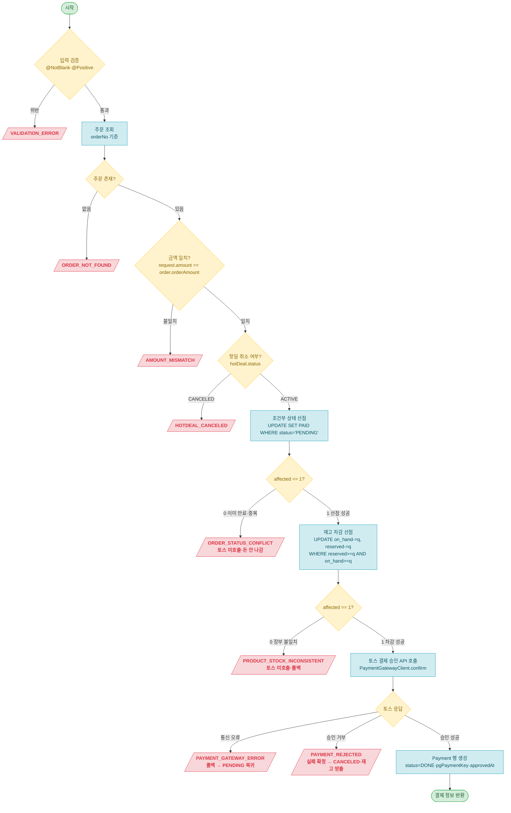
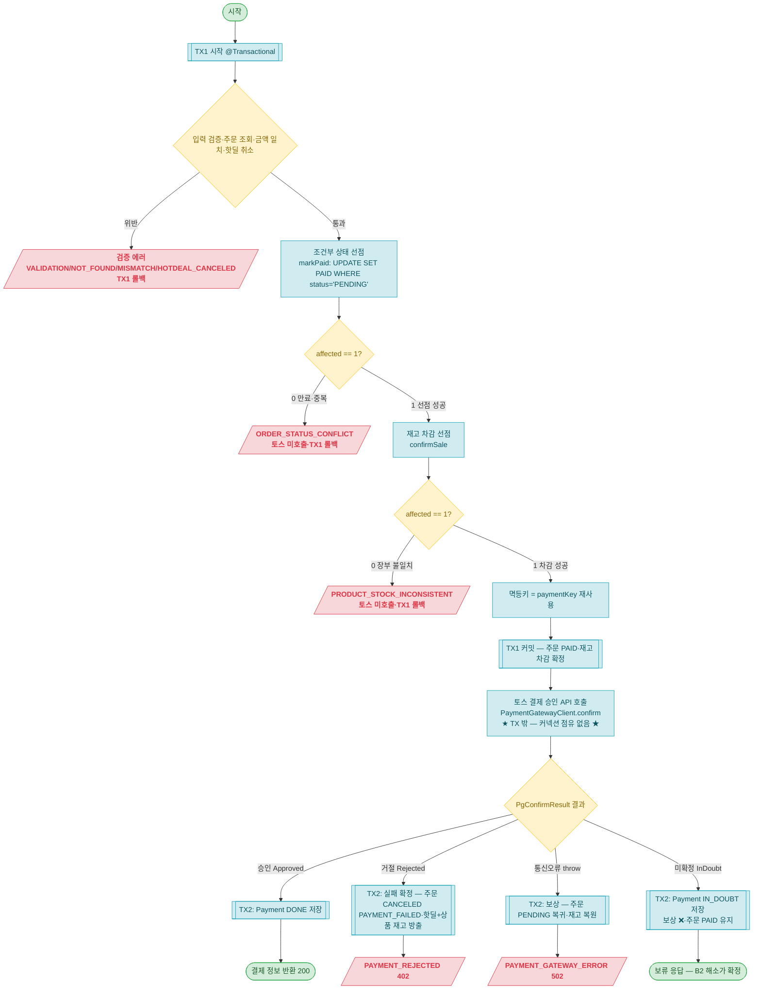

# 결제(payment) User API 설계 문서

> 공통 정의(엔티티·Enum·응답 형식·ExceptionCode·제약)는 [api-design.md](api-design.md) 참조.

## API 목록 (1개)

| # | Method | Endpoint | 설명 |
|---|--------|----------|------|
| 1 | POST | `/api/payments/confirm` | 결제 승인 |

---

## 1. 결제 승인

```
POST /api/payments/confirm
```

> 회원이 토스 결제창에서 완료한 결제를 서버에서 최종 확정한다. 프론트엔드가 토스 successUrl에서 받은 paymentKey·orderId(=orderNo)·amount를 전달하면, 서버가 금액을 검증하고 **주문을 PENDING→PAID로 먼저 선점한 뒤**(조건부 전이) 토스 결제 승인 API를 호출하고, 성공하면 Payment 행을 생성한다.
>
> 인증: 회원 전용 (USER/ADMIN 무관, 비회원 401). **본인 주문만 승인 가능** — 타인 주문은 404(존재 여부 은닉).
>
> **Phase B1(실연동) 변경 요약**: 아래 슬라이스3~5 본문은 stub 대역 기준의 단일 TX 흐름이다. Phase B1에서 ① 토스 호출을 **DB 트랜잭션 밖**으로 분리(선점·차감은 TX1, 결과 반영은 TX2), ② 거절은 **실패 확정**(주문 CANCELED·핫딜+상품 재고 방출 — 핫딜 정책: 실패 즉시 방출, 재시도는 새 주문으로), 통신오류(요청 미도달)는 **보상 롤백**(주문 PENDING 복귀·재고 복원), ③ **미확정(타임아웃·응답유실)**은 롤백 대신 `IN_DOUBT`로 보존한다. 상세는 본 절 끝 "Phase B1 — 실연동 변경" + [공통 정의 "Phase B1 — 토스 결제 실연동"](api-design.md).

**Request**

| 구분 | 파라미터 | 타입 | 필수 | Validation | 설명 |
|------|----------|------|:--:|------------|------|
| Body | paymentKey | String | O | @NotBlank | 토스가 발급한 PG 거래 키 (max 200자) |
| Body | orderId | String | O | @NotBlank | 주문 번호 (order.orderNo — 토스 orderId 겸용) |
| Body | amount | BigDecimal | O | @NotNull @Positive | 결제 금액 (서버가 order.orderAmount와 대조) |

**Request Body 예시**

```json
{
  "paymentKey": "5zJ4xY7m0kODnyRpQWGrN2xqGlNvLrKwv1M9ENjbeoPaZdL6",
  "orderId": "550e8400-e29b-41d4-a716-446655440000",
  "amount": 19800
}
```

**검증**

| 검증 항목 | 방식 | 에러코드 |
|-----------|------|----------|
| paymentKey 필수 | @NotBlank | VALIDATION_ERROR |
| orderId 필수 | @NotBlank | VALIDATION_ERROR |
| amount 필수·양수 | @NotNull @Positive | VALIDATION_ERROR |
| 주문 존재 | 비즈니스 검증 (CommonOrderService.getOrderForPayment) | ORDER_NOT_FOUND |
| 주문 소유자 일치 | 비즈니스 검증 (order.validateOwnedBy — 토스 호출 전) | ORDER_NOT_FOUND (403 아님 — 존재 여부 은닉) |
| 금액 일치 | 비즈니스 검증 (order.validatePaymentAmount) | AMOUNT_MISMATCH |
| 핫딜 취소 여부 | 비즈니스 검증 (validateNotCanceledIfHotDeal) | HOTDEAL_CANCELED |
| **조건부 상태 선점** | @Modifying UPDATE WHERE status='PENDING' **AND expiresAt > now**, affected==1 **(토스 호출 전)** | ORDER_STATUS_CONFLICT |
| **재고 차감 선점** | @Modifying UPDATE WHERE reserved≥qty AND on_hand≥qty, affected==1 **(토스 호출 전, 선점 직후)** | PRODUCT_STOCK_INCONSISTENT |
| 토스 승인 API 호출 | 토스 응답 처리 (TossPaymentClient, **선점·차감 성공 후**) | PAYMENT_GATEWAY_ERROR / PAYMENT_REJECTED |

> **설계 노트 — 금액 검증 위치**: 토스 호출 전에 `order.orderAmount.compareTo(request.amount) == 0`을 서버가 비교한다. 토스도 금액 불일치 시 거부하지만, 우리가 먼저 잡으면 왕복 비용을 줄이고 400으로 명확한 에러를 반환할 수 있다.

> **설계 노트 — 핫딜 취소 차단**: 토스 호출 전에 핫딜 status를 확인한다. CANCELED이면 돈이 움직이기 전에 거부([ADR-0007 결정2](../adr/0007-hotdeal-state-operations.md)). hotDeal은 order에 이미 연관 매핑돼 있으므로 `order.getHotDeal().getStatus()` LAZY 로드 1회로 처리한다.

> **설계 노트 — markPaid 만료 가드(2026-07-06)**: 선점 조건에 `AND expiresAt > now`를 더해, 만료 시각이 지났지만 만료 스케줄러가 아직 못 쓸어간 PENDING 주문은 confirm이 affected==0으로 걸러 토스를 호출하지 않는다(만료된 결제창은 결제 불가). 이로써 "markPaid는 만료 전에만 성공"이 코드로 보장돼, 고아 해소의 유예 논증([system 설계](api-design-system.md))이 참이 된다.

> **설계 노트 — 선점 순서(슬라이스4 재배치)**: 슬라이스3은 "토스 승인(돈 나감) → markPaid"였다. 슬라이스4에서 **markPaid 조건부 선점을 토스 승인 앞으로** 옮긴다. 주문을 먼저 `UPDATE ... WHERE status='PENDING'`으로 선점해 **affected==1일 때만** 토스를 호출한다. 그러면 ① 만료로 이미 CANCELED된 주문(만료↔결제 경합)과 ② 이미 PAID된 주문(이중 승인)이 **토스 호출 전에 affected==0으로 걸러져 돈이 나가지 않는다**. 토스가 거부하면 같은 트랜잭션이 롤백돼 선점한 PAID가 PENDING으로 자동 복귀하므로(우리 DB 안의 일이라 외부 보정 불필요), "돈만 나간 채 주문은 무효"인 상황 자체가 평상시 흐름에서 사라진다. 슬라이스3의 "토스 먼저 → 돈 나간 승인은 토스 취소 보정" 계획을 이 순서 재배치가 대체한다([ADR-0008](../adr/0008-payment-model-pg-boundary.md) "함께 묶이는 방어" 갱신).

**Response**

```json
{
  "result": true,
  "data": {
    "paymentId": 1,
    "orderId": 1,
    "orderNo": "550e8400-e29b-41d4-a716-446655440000",
    "amount": 19800,
    "status": "DONE",
    "approvedAt": "2026-06-24T12:05:40"
  }
}
```

**Response 필드**

| 필드 | 타입 | 설명 | 매핑 |
|------|------|------|------|
| paymentId | Long | 결제 ID | `payment.id` (MapStruct `@Mapping(source="id", target="paymentId")`) |
| orderId | Long | 주문 ID | `payment.orderId` |
| orderNo | String | 주문 번호 | Order 별도 조회 필요 (응답 설계 단순화 시 제거 가능) |
| amount | BigDecimal | 결제 금액 | `payment.amount` |
| status | PaymentStatus | 결제 상태 — `DONE`(확정) / `IN_DOUBT`(미확정 보류: 클라이언트는 "결제 완료"로 표시하면 안 됨, 해소 스케줄러가 확정) | `payment.status` |
| approvedAt | LocalDateTime | 승인 시각 (IN_DOUBT이면 없음) | `payment.approvedAt` |

**테스트 리스트**

> vertical TDD 사이클로 한 줄씩 누적한다([commit-checkpoint.md](../../.claude/rules/commit-checkpoint.md)). 설계 단계는 헤더만 둔다(placeholder 행 금지).

| # | 테스트 케이스 | 시나리오 | 상태 | 작성일 |
|---|---------------|----------|------|--------|
| 1 | `결제_승인_성공_시_Payment_DONE_생성_주문_PAID_전이` | PENDING 주문 + 토스 승인 성공 mock → 200, Payment DONE 생성, Order PAID 전이 | ✅ Pass | 2026-06-24 |
| 2 | `만료_CANCELED_주문_결제_승인_시_409_ORDER_STATUS_CONFLICT_Payment_미생성` | 만료로 CANCELED된 주문 → 선점 affected==0 → **토스 미호출**(verify never), 409 ORDER_STATUS_CONFLICT, Payment 0건, 주문 CANCELED 유지 | ✅ Pass | 2026-06-25 |
| 3 | `이미_PAID_주문_결제_승인_시_409_ORDER_STATUS_CONFLICT_Payment_미생성` | 이미 PAID된 주문 → 선점 affected==0 → **토스 미호출**(verify never), 409 ORDER_STATUS_CONFLICT, Payment 0건, 주문 PAID 유지 | ✅ Pass | 2026-06-25 |
| 4 | `금액_불일치_시_토스_호출_전_400_AMOUNT_MISMATCH_차단` | request.amount ≠ order.orderAmount → 400 AMOUNT_MISMATCH, 토스 미호출(never), Payment 0건, 주문 PENDING 유지 | ✅ Pass | 2026-06-24 |
| 5 | `토스_거부_시_402_주문_CANCELED_재고_방출` | 토스 거절(Rejected) → 402 PAYMENT_REJECTED, 주문 CANCELED(PAYMENT_FAILED), 핫딜+상품 재고 방출, Payment 0건 (2026-07-03 핫딜 방향 반영 — 구 명세는 PENDING 유지) | ✅ Pass | 2026-07-03 |
| 6 | `동시_결제_승인_시_1건만_PAID_나머지_ORDER_STATUS_CONFLICT_Payment_1건` | PENDING 주문 1건에 8스레드 동시 승인 → 선점 직렬화로 1건만 PAID(**토스 1회**), 7건 ORDER_STATUS_CONFLICT(토스 미호출), Payment 1건 | ✅ Pass | 2026-06-25 |
| 7 | `결제_확정_시_ProductStock_실물_예약_차감` | 결제 확정(confirm 성공) → ProductStock onHand·reserved 각 1↓(`confirmSale`, 주문 수량만큼) | ✅ Pass | 2026-06-25 |
| 8 | `타인_주문_승인_시_404_ORDER_NOT_FOUND_토스_미호출` | 다른 사용자 토큰으로 confirm → 404 ORDER_NOT_FOUND(존재 은닉), 토스 미호출(never), 주문 PENDING 유지, Payment 0건 | ✅ Pass | 2026-07-04 |

> **설계 노트 — 슬라이스4 재배치가 기존 테스트에 주는 영향**: 흐름이 "선점 먼저"로 바뀌면 #2(만료 CANCELED)·#3(이미 PAID)·#6(동시 7건 충돌)은 **토스를 호출하지 않고** affected==0으로 걸러진다(슬라이스3에서는 토스 승인 mock을 거친 뒤 markPaid 0건이었다). 단언의 핵심(409·Payment 0건/1건·주문 상태)은 동일하나, 검증 포인트가 "토스 승인 성공 후 충돌"에서 "**선점 단계에서 토스 호출 자체를 차단(verify never)**"으로 강해진다. Phase 2 TDD에서 해당 테스트의 토스 호출 단언(`verify(...).never()`)을 보강한다.

**구현 로직**



> **설계 노트 — 트랜잭션 경계**: PaymentFacade `confirm` 메서드에 `@Transactional`을 선언해 조회·검증·선점·재고 차감·토스 호출·Payment 생성을 하나의 TX로 묶는다. **선점(markPaid)이 토스 호출 앞**에 오므로, 토스 승인이 거부·오류이면 TX 롤백으로 선점한 PAID가 PENDING으로 자동 복귀한다(우리 DB만 되돌리면 됨 — 토스는 돈이 안 나갔다). 결제 승인은 구매 폭발(슬라이스1)과 달리 사용자가 결제창에서 카드 정보 입력·인증을 거쳐 순차적으로 들어오므로 동시 요청이 자연 분산된다 — TX 안에 토스 응답 대기가 포함되는 커넥션 점유 비용이 실제 문제가 될 규모가 아니다. TX를 분리하면 detached 처리·TransactionTemplate 등 복잡도만 늘어난다.

> **설계 노트 — 재고 차감도 토스 앞 선점**: 결제가 확정되면 그 1개가 실제로 팔린 것이므로 상품 창고의 실물·예약을 1씩 줄인다([ADR-0011 결정3](../adr/0011-product-inventory-reservation.md)). `markPaid` 선점 직후·**토스 앞**에 두고(주문→재고 잠금 순서 — [ADR-0009 결정4](../adr/0009-stock-concurrency-design.md)), `reserve`와 대칭인 조건부 UPDATE로 `affected==1`일 때만 토스를 호출한다. **차감 실패(affected==0)는 "재고 부족"이 아니다** — 품절은 구매(주문) 단계에서 `HotDealStock`으로 이미 막히고, 결제까지 온 주문은 핫딜 등록 때 잡아둔 예약분 안에 있어 정상이면 항상 차감된다. `affected==0`은 예약/실물 장부가 어긋난 **정합성 깨짐**(정상이면 안 남)이라 `PRODUCT_STOCK_INCONSISTENT`로 막는데, 토스 앞이라 그 즉시 롤백돼 돈이 나가지 않는다. 정상이면 안 나는 시스템 불일치라 HttpStatus는 500을 제안한다(운영 알림 대상 — 사용자에게 보이는 "재고 부족"이 아님).

> **설계 노트 — 선점이 잡는 행 잠금과 토스 대기**: 선점 `UPDATE ... WHERE status='PENDING'`은 해당 주문 **한 행**에 잠금을 잡고 그 잠금을 토스 응답까지 유지한다. 행 단위라 다른 주문 결제엔 영향이 없고, 같은 주문에 동시 결제가 몰리는 경우(이중 승인)는 드물며 오히려 이 잠금이 **둘째 요청을 직렬화로 막아**(첫째 커밋 후 둘째는 affected==0) 토스 이중 호출을 차단한다. 만료 스케줄러가 같은 주문을 동시에 만료시키려 해도 같은 행 잠금에서 직렬화된다 — 결제가 선점 PAID로 커밋하면 만료 쪽 조건부 전이가 affected==0으로 비켜간다([order System 설계 — 조건부 만료 전이](../order/api-design-system.md)).

> **설계 노트 — ORDER_STATUS_CONFLICT 단일화**: affected==0에는 만료로 이미 CANCELED된 케이스와 이미 PAID(중복 승인)가 섞여 있다. UPDATE 한 번으로는 어느 쪽인지 알 수 없고, 조회→UPDATE→분기 순서는 확인-결정-쓰기 사이에 끼어드는 경합(TOCTOU)을 다시 만든다. `ORDER_STATUS_CONFLICT`(409) 하나로 "이미 PENDING이 아닌 상태"를 표현한다.

> **설계 노트 — 남는 잔여와 그 처리(슬라이스4 범위 밖)**: 선점 순서로도 못 없애는 단 하나의 틈은 "토스 승인 성공(돈 나감) **직후** 우리 DB 커밋 실패·서버 다운"이다 — 외부 결제와 우리 DB는 하나의 원자 작업으로 못 묶이는(두 시스템에 따로 쓰기, dual-write) 분산 시스템 본질이라 순서로 제거 불가. 다만 이 케이스는 **요청 스레드 자체가 죽는** 장애라 "같은 요청에서 토스 취소"라는 동기 보정이 불가능하고, 오직 비동기(웹훅·만료 전 토스 조회·해소)로만 복구된다. 그 복구 원칙은 [ADR-0004 결정4](../adr/0004-stock-reservation-lifecycle.md)("성공한 결제는 강제 환불하지 않고 주문을 되살린다")가 이미 정의했고, 구현은 후속 결제 웹훅/해소 슬라이스로 미룬다.

**엔티티 메서드 설계**

`Payment.create`는 PG 승인 결과를 받아 DONE 상태 행을 생성한다. 아래는 구현 가이드용 의사 코드다.

```java
// Payment — 정적 팩토리 (승인 성공 결과 캡슐화, 슬라이스3과 동일)
public static Payment create(Order order, PgConfirmResult pgResult) {
    return Payment.builder()
        .orderId(order.getId())
        .amount(pgResult.amount())
        .status(PaymentStatus.DONE)
        .pgPaymentKey(pgResult.pgPaymentKey())
        .approvedAt(pgResult.approvedAt())
        .build();
}
```

**쿼리 설계**

```java
// OrderRepository — orderNo 기준 단건 조회 (슬라이스3과 동일)
Optional<Order> findByOrderNo(String orderNo);

// OrderRepository — 조건부 PAID 선점 (만료 스케줄러·이중 승인과 경합 방어)
@Modifying
@Query("UPDATE Order o SET o.status = 'PAID' WHERE o = :order AND o.status = 'PENDING'")
int markPaid(@Param("order") Order order);

// ProductStockRepository — 결제 확정 시 실물·예약 동시 차감 (reserve 대칭, 음수 방지 + affected==0 불일치 감지)
@Modifying
@Query("""
    UPDATE ProductStock ps
       SET ps.onHandQuantity = ps.onHandQuantity - :quantity,
           ps.reservedQuantity = ps.reservedQuantity - :quantity
     WHERE ps.productId = :productId
       AND ps.reservedQuantity >= :quantity
       AND ps.onHandQuantity >= :quantity
""")
int confirmSale(@Param("productId") Long productId, @Param("quantity") int quantity);
```

> **설계 노트 — markPaid 반환 int**: `@Modifying @Query`의 반환 타입을 `int`로 받는다. `== 1`이면 선점 성공(이어서 토스 호출), `== 0`이면 `ORDER_STATUS_CONFLICT`를 던져 토스를 호출하지 않는다. 선점이 토스 앞에 오므로, 슬라이스3에서 "토스 성공 후 markPaid"였던 순서가 "markPaid 성공 후 토스"로 바뀐다.

> **설계 노트 — CommonOrderService**: `getOrderForPayment(orderNo, amount)`(조회+금액 검증)와 `markPaid(Order): int`를 `CommonOrderService`에 둔다 — "모든 결제 승인 요청이 동일하게 수행해야 하는 정규 연산"([service.md](../../.claude/rules/service.md)). Facade `@Transactional` TX 안에서 호출되므로 hotDeal LAZY 로드도 같은 TX 안에서 처리된다. `markPaid`는 `@Transactional`(REQUIRED 기본값)으로 Facade TX에 합류한다.

> **설계 노트 — 계층 경계**: PaymentFacade가 `CommonOrderService`(order 도메인), `CommonHotDealService`(hotdeal 도메인), `ProductStockService`(stock 도메인), `PaymentGatewayClient`, `PaymentService`를 조합한다. Facade `@Transactional` 안에서 조회+금액검증 → 핫딜 취소 가드 → `commonOrderService.markPaid`(선점) → `productStockService.confirmSale`(재고 차감 선점, `order.getProduct().getId()`·`order.getQuantity()`) → `paymentGatewayClient.confirm`(토스) → `paymentService.createPayment` 순으로 실행된다. `Payment.create`에 `Order` 객체 대신 `Long orderId`를 저장하는 이유는 entity.md 규칙("객체 탐색이 불필요한 참조는 FK 값 칼럼 허용") 적용이다. PaymentService는 자기 도메인 `PaymentRepository`만 의존한다.

---

## Phase B1 — 실연동 변경 (POST /api/payments/confirm)

> 위 슬라이스3~5 본문(단일 TX·stub 대역)을 Phase B1에서 교정한다. 공통 결정·근거는 [공통 정의 "Phase B1 — 토스 결제 실연동"](api-design.md)에, 여기엔 confirm API에 직접 닿는 흐름·검증·테스트만 둔다.

**검증 (Phase B1 추가/변경)**

| 검증 항목 | 방식 | 결과 |
|-----------|------|------|
| 토스 승인 거부 — **거절 코드 목록(`REJECT_CODES`)** (카드 거절·잔액부족·한도초과·FDS 차단 등) | `TossPaymentClient`가 `Rejected` 분류 | **실패 확정** 후 402 `PAYMENT_REJECTED` — 주문 `CANCELED(PAYMENT_FAILED)` + 핫딜·상품 재고 방출(핫딜 정책: 확정 실패는 즉시 방출, 재시도는 새 주문) |
| 토스 통신 오류 — **응답을 못 받음**(connect 실패·DNS, 요청 미도달) | `TossPaymentClient`가 `GatewayError` 분류(예상 못한 예외는 그대로 전파=500) | **보상 롤백** 후 502 `PAYMENT_GATEWAY_ERROR` |
| 토스 미확정 — **거절 코드가 아닌 응답 전부**(처리오류·모르는 code·5xx 포함) 또는 read 타임아웃·소켓 끊김 | `TossPaymentClient`가 `REJECT_CODES` 외는 전부 `InDoubt` 분류(상태값 안 봄) | **보상 안 함** — Payment `IN_DOUBT` 생성, 주문 PAID·재고 차감 유지(돈 나감 가능 → B2 해소로 확정) |
| confirm 재시도 멱등(같은 주문·같은 paymentKey 재호출) | 멱등키=paymentKey 재사용 + 토스 멱등 보장 + `markPaid` 조건부 전이(주문당 PAID 1회). `pgPaymentKey` UNIQUE 충돌 핸들링은 없음 — markPaid 방어로 도달 불가([공통 정의 B1-3](api-design.md)) | 이중 승인·이중 출금은 토스 멱등이 차단. 저장 후 재요청은 409 유지(자기 API 멱등 재응답은 검토·기각 — [api-design.md](api-design.md)) |

> **설계 노트 — 확정 실패 vs 미도달 vs 미확정 (세 갈래)**: ① **거절(확정 실패, 돈 안 나감)** → 핫딜 방향(실패 즉시 방출)에 따라 주문 `CANCELED(PAYMENT_FAILED)` 종료 + 재고 방출. 활성 유니크가 풀려 재시도는 새 주문으로. ② **통신오류(요청 미도달 — 우리/네트워크 문제, 사용자 잘못 아님)** → 주문을 죽이지 않고 PENDING 복귀 + 상품 재고 복원(만료가 백스톱). ③ **미확정(돈 나갔을 수 있음)** → 되돌리면 "돈 나감+재고 복원"이라는 더 나쁜 불일치 — 보상 없이 주문 PAID·재고 차감 유지한 채 IN_DOUBT 보존([ADR-0004 결정4](../adr/0004-stock-reservation-lifecycle.md)).

**구현 로직 (Phase B1 — TX 경계 분리)**



> **설계 노트 — 보상도 조건부 전이**: 보상의 주문 PENDING 복귀는 `UPDATE ... WHERE status='PAID' AND order=:order`(affected 관문) 조건부 전이로 한다. TX1 커밋과 보상 사이에 만료 스케줄러가 끼어들 수 없다(주문은 이미 PAID라 만료 조건부 전이가 affected==0으로 비켜감). 재고 복원은 `confirmSale`의 역연산(`onHand+=q, reserved+=q`)이다. 보상(PENDING 복귀)은 **통신오류(요청 미도달)에만** 실행한다 — 거절은 보상이 아니라 **실패 확정**(`markPaymentFailed` 조건부 전이 + 핫딜·상품 재고 방출)으로 종료하고, 미확정엔 둘 다 절대 실행하지 않는다.

> **설계 노트 — 멱등키**: 별도 서버 UUID 를 발급·보관하지 않고 **토스가 발급한 `paymentKey`를 그대로 멱등키로** 헤더(`Idempotency-Key`)에 전송한다. 같은 결제의 confirm 재호출(재전송·B2 해소의 재시도)은 같은 paymentKey → 토스가 첫 결과를 그대로 반환한다. 재사용·`pgPaymentKey` UNIQUE 충돌 규약은 [공통 정의 B1-3](api-design.md).

**엔티티 메서드 설계 (Phase B1 추가)**

> `Payment.create`(항상 DONE) 가정이 깨진다 — 미확정 행 생성 경로가 생긴다. 아래는 구현 가이드용 의사 코드다.

```java
// Payment — 미확정 결과 행 생성 (B1 신설). create(승인)와 별도 팩토리
public static Payment createInDoubt(Order order, BigDecimal amount, String pgPaymentKey) {
    return Payment.builder()
        .orderId(order.getId())
        .amount(amount)
        .status(PaymentStatus.IN_DOUBT)
        .pgPaymentKey(pgPaymentKey)        // B2 해소가 토스 조회에 사용
        .build();                          // approvedAt 없음 — 아직 미확정
}
```

**쿼리 설계 (Phase B1 추가)**

```java
// OrderRepository — 보상: PAID → PENDING 복귀 (거절·통신오류 확정 시, 조건부 전이)
@Modifying
@Query("UPDATE Order o SET o.status = 'PENDING' WHERE o = :order AND o.status = 'PAID'")
int markPending(@Param("order") Order order);

// ProductStockRepository — 보상: 재고 복원 (confirmSale 역연산)
@Modifying
@Query("""
    UPDATE ProductStock ps
       SET ps.onHandQuantity = ps.onHandQuantity + :quantity,
           ps.reservedQuantity = ps.reservedQuantity + :quantity
     WHERE ps.productId = :productId
""")
int restoreSale(@Param("productId") Long productId, @Param("quantity") int quantity);
```

> **설계 노트 — Repository/메서드/ExceptionCode 신규는 TDD GREEN에서**: `markPending`·`restoreSale`·`createInDoubt`·`PaymentStatus.IN_DOUBT`·sealed `PgConfirmResult` 타입은 위 의사 코드일 뿐 미리 구현하지 않는다 — 각각을 정당화하는 실패 테스트(아래 테스트 리스트)가 생길 때 함께 추가한다([commit-checkpoint.md](../../.claude/rules/commit-checkpoint.md) vertical TDD).

**테스트 리스트 (Phase B1)**

> 위 슬라이스3~5 테스트(#1~7, ✅)는 그대로 유지된다(단일 TX 대역 기준 — TX 분리 후에도 단언의 핵심은 보존). Phase B1 신규 행위는 아래 표에 vertical TDD 사이클마다 한 줄씩 누적한다. 설계 단계는 헤더만 둔다(placeholder 행 금지). 통합 테스트는 `PaymentGatewayClient` 대역으로 결과(승인/거절/미확정)를 제어하고, 실HTTP는 `TossHttpClient` 단위 테스트(MockWebServer)로 격리한다([ADR-0001](../adr/0001-payment-gateway-toss.md) 토스 실API 호출 금지).

| # | 테스트 케이스 | 시나리오 | 상태 | 작성일 |
|---|---------------|----------|------|--------|
| 1 | `토스_결과_sealed_분기_거부_Rejected_결과값_402` | paymentGatewayClient가 sealed `Rejected()` 결과값 반환 → Facade switch 분기 → 402 PAYMENT_REJECTED, 주문 CANCELED(PAYMENT_FAILED)·핫딜+상품 재고 방출(실패 확정), Payment 0건 | ✅ Pass | 2026-06-30 · 07-03 갱신 |
| 2 | `토스_미확정_InDoubt_시_IN_DOUBT_보존_주문_PAID_유지` | paymentGatewayClient가 `InDoubt()` 반환 → 보상 없이 Payment IN_DOUBT 생성, 주문 PAID·재고 차감 유지, 200 + `status=IN_DOUBT`(보류 — approvedAt 없음, 완료로 위장 금지) | ✅ Pass | 2026-07-01 · 07-04 갱신 |
| 3 | `토스_통신오류_GatewayError_결과값_시_502_보상_롤백` | paymentGatewayClient가 `GatewayError()` 결과값 반환 → Facade switch 분기 → revertPreemption(markPending·restoreSale) 후 502 PAYMENT_GATEWAY_ERROR, 주문 PENDING·재고 복원, Payment 0건 | ✅ Pass | 2026-07-01 |
| 4 | `토스_승인_2xx_Approved_매핑` | (단위·MockWebServer) 토스 승인 응답(status DONE, approvedAt) → TossPaymentClient가 `Approved` 결과로 매핑(@HttpExchange 실HTTP) | ✅ Pass | 2026-07-01 |
| 5 | `토스_4xx_거부_Rejected_매핑` | (단위) 토스 400 응답 → `Rejected` 결과 | ✅ Pass | 2026-07-01 |
| 6 | `토스_read타임아웃_InDoubt_매핑` | (단위) 응답 유실(NO_RESPONSE) → `InDoubt`(요청 도달, 결과 모름) | ✅ Pass | 2026-07-01 |
| 7 | `토스_연결실패_GatewayError_매핑` | (단위) connect 실패·DNS(응답 못 받음, 요청 미도달 — cause 분류) → `GatewayError`(되돌려도 안전) | ✅ Pass | 2026-07-01 |
| 8 | `토스_Idempotency_Key_헤더_paymentKey_전송` | (단위) confirm 요청 헤더에 `Idempotency-Key: paymentKey` 전송 — 재전송 시 이중 출금 방지 | ✅ Pass | 2026-07-01 |
| 9 | `토스_상태불명_에러코드_InDoubt_매핑` | (단위·실토스 실측 근거) error `code`가 `PROVIDER_ERROR`(400)·`FAILED_PAYMENT_INTERNAL_SYSTEM_PROCESSING`/`FAILED_INTERNAL_SYSTEM_PROCESSING`/`UNKNOWN_PAYMENT_ERROR`(500)면 HTTP 상태 무관 `InDoubt` — 상태값 분류로는 못 가름 | ✅ Pass | 2026-07-01 |
| 10 | `토스_FDS_ERROR_Rejected_매핑` | (단위) `FDS_ERROR`(403, 위험거래 차단 — 돈 안 빠짐)는 `REJECT_CODES`에 있어 `Rejected` | ✅ Pass | 2026-07-01 |
| 11 | `토스_알수없는_code_InDoubt_안전기본값` | (단위) `REJECT_CODES`에 없는 처음 보는 code → `InDoubt`(모르면 안 되돌림 — 성공 결제 취소 방지) | ✅ Pass | 2026-07-01 |
| 12 | `토스_거절코드_아닌_5xx_InDoubt_매핑` | (단위) code 없는 순수 502 → `InDoubt`(응답 받음=토스 닿음, 상태 불명 — GatewayError 아님) | ✅ Pass | 2026-07-01 |
| 13 | `토스_ALREADY_PROCESSED_InDoubt_매핑` | (단위·함정 방어) `ALREADY_PROCESSED_PAYMENT`(이미 결제됨=돈 빠짐)는 `REJECT_CODES`에서 제외 → `InDoubt`(성공 결제 되돌림 방지) | ✅ Pass | 2026-07-01 |

