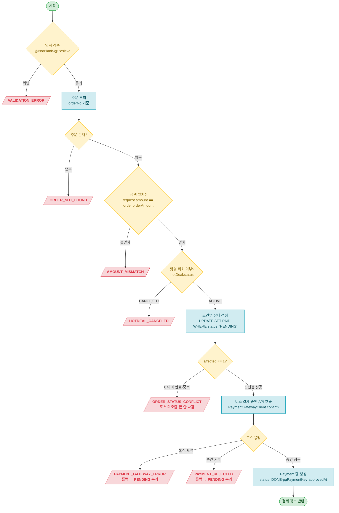

# 결제(payment) User API 설계 문서

> 공통 정의(엔티티·Enum·응답 형식·ExceptionCode·제약)는 [api-design.md](api-design.md) 참조.

## API 목록 (1개)

| # | Method | Endpoint | 설명 |
|---|--------|----------|------|
| 1 | POST | `/api/payments/confirm` | 결제 승인 |

---

## 1. 결제 승인

```
POST /api/payments/confirm
```

> 회원이 토스 결제창에서 완료한 결제를 서버에서 최종 확정한다. 프론트엔드가 토스 successUrl에서 받은 paymentKey·orderId(=orderNo)·amount를 전달하면, 서버가 금액을 검증하고 **주문을 PENDING→PAID로 먼저 선점한 뒤**(조건부 전이) 토스 결제 승인 API를 호출하고, 성공하면 Payment 행을 생성한다.
>
> 인증: 회원 전용 (USER/ADMIN 무관, 비회원 401).

**Request**

| 구분 | 파라미터 | 타입 | 필수 | Validation | 설명 |
|------|----------|------|:--:|------------|------|
| Body | paymentKey | String | O | @NotBlank | 토스가 발급한 PG 거래 키 (max 200자) |
| Body | orderId | String | O | @NotBlank | 주문 번호 (order.orderNo — 토스 orderId 겸용) |
| Body | amount | BigDecimal | O | @NotNull @Positive | 결제 금액 (서버가 order.orderAmount와 대조) |

**Request Body 예시**

```json
{
  "paymentKey": "5zJ4xY7m0kODnyRpQWGrN2xqGlNvLrKwv1M9ENjbeoPaZdL6",
  "orderId": "550e8400-e29b-41d4-a716-446655440000",
  "amount": 19800
}
```

**검증**

| 검증 항목 | 방식 | 에러코드 |
|-----------|------|----------|
| paymentKey 필수 | @NotBlank | VALIDATION_ERROR |
| orderId 필수 | @NotBlank | VALIDATION_ERROR |
| amount 필수·양수 | @NotNull @Positive | VALIDATION_ERROR |
| 주문 존재 | 비즈니스 검증 (CommonOrderService.getOrderForPayment) | ORDER_NOT_FOUND |
| 금액 일치 | 비즈니스 검증 (order.validatePaymentAmount) | AMOUNT_MISMATCH |
| 핫딜 취소 여부 | 비즈니스 검증 (validateNotCanceledIfHotDeal) | HOTDEAL_CANCELED |
| **조건부 상태 선점** | @Modifying UPDATE WHERE status='PENDING', affected==1 **(토스 호출 전)** | ORDER_STATUS_CONFLICT |
| 토스 승인 API 호출 | 토스 응답 처리 (TossPaymentClient, **선점 성공 후**) | PAYMENT_GATEWAY_ERROR / PAYMENT_REJECTED |

> **설계 노트 — 금액 검증 위치**: 토스 호출 전에 `order.orderAmount.compareTo(request.amount) == 0`을 서버가 비교한다. 토스도 금액 불일치 시 거부하지만, 우리가 먼저 잡으면 왕복 비용을 줄이고 400으로 명확한 에러를 반환할 수 있다.

> **설계 노트 — 핫딜 취소 차단**: 토스 호출 전에 핫딜 status를 확인한다. CANCELED이면 돈이 움직이기 전에 거부([ADR-0007 결정2](../adr/0007-hotdeal-state-operations.md)). hotDeal은 order에 이미 연관 매핑돼 있으므로 `order.getHotDeal().getStatus()` LAZY 로드 1회로 처리한다.

> **설계 노트 — 선점 순서(슬라이스4 재배치)**: 슬라이스3은 "토스 승인(돈 나감) → markPaid"였다. 슬라이스4에서 **markPaid 조건부 선점을 토스 승인 앞으로** 옮긴다. 주문을 먼저 `UPDATE ... WHERE status='PENDING'`으로 선점해 **affected==1일 때만** 토스를 호출한다. 그러면 ① 만료로 이미 CANCELED된 주문(만료↔결제 경합)과 ② 이미 PAID된 주문(이중 승인)이 **토스 호출 전에 affected==0으로 걸러져 돈이 나가지 않는다**. 토스가 거부하면 같은 트랜잭션이 롤백돼 선점한 PAID가 PENDING으로 자동 복귀하므로(우리 DB 안의 일이라 외부 보정 불필요), "돈만 나간 채 주문은 무효"인 상황 자체가 평상시 흐름에서 사라진다. 슬라이스3의 "토스 먼저 → 돈 나간 승인은 토스 취소 보정" 계획을 이 순서 재배치가 대체한다([ADR-0008](../adr/0008-payment-model-pg-boundary.md) "함께 묶이는 방어" 갱신).

**Response**

```json
{
  "result": true,
  "data": {
    "paymentId": 1,
    "orderId": 1,
    "orderNo": "550e8400-e29b-41d4-a716-446655440000",
    "amount": 19800,
    "approvedAt": "2026-06-24T12:05:40"
  }
}
```

**Response 필드**

| 필드 | 타입 | 설명 | 매핑 |
|------|------|------|------|
| paymentId | Long | 결제 ID | `payment.id` (MapStruct `@Mapping(source="id", target="paymentId")`) |
| orderId | Long | 주문 ID | `payment.orderId` |
| orderNo | String | 주문 번호 | Order 별도 조회 필요 (응답 설계 단순화 시 제거 가능) |
| amount | BigDecimal | 결제 금액 | `payment.amount` |
| approvedAt | LocalDateTime | 승인 시각 | `payment.approvedAt` |

**테스트 리스트**

> vertical TDD 사이클로 한 줄씩 누적한다([commit-checkpoint.md](../../.claude/rules/commit-checkpoint.md)). 설계 단계는 헤더만 둔다(placeholder 행 금지).

| # | 테스트 케이스 | 시나리오 | 상태 | 작성일 |
|---|---------------|----------|------|--------|
| 1 | `결제_승인_성공_시_Payment_DONE_생성_주문_PAID_전이` | PENDING 주문 + 토스 승인 성공 mock → 200, Payment DONE 생성, Order PAID 전이 | ✅ Pass | 2026-06-24 |
| 2 | `만료_CANCELED_주문_결제_승인_시_409_ORDER_STATUS_CONFLICT_Payment_미생성` | 만료로 CANCELED된 주문 → 선점 affected==0 → **토스 미호출**(verify never), 409 ORDER_STATUS_CONFLICT, Payment 0건, 주문 CANCELED 유지 | ✅ Pass | 2026-06-25 |
| 3 | `이미_PAID_주문_결제_승인_시_409_ORDER_STATUS_CONFLICT_Payment_미생성` | 이미 PAID된 주문 → 선점 affected==0 → **토스 미호출**(verify never), 409 ORDER_STATUS_CONFLICT, Payment 0건, 주문 PAID 유지 | ✅ Pass | 2026-06-25 |
| 4 | `금액_불일치_시_토스_호출_전_400_AMOUNT_MISMATCH_차단` | request.amount ≠ order.orderAmount → 400 AMOUNT_MISMATCH, 토스 미호출(never), Payment 0건, 주문 PENDING 유지 | ✅ Pass | 2026-06-24 |
| 5 | `토스_거부_시_402_PAYMENT_REJECTED_주문_PENDING_유지` | paymentGatewayClient 거부(DomainException) → 402 PAYMENT_REJECTED, 주문 PENDING 유지, Payment 0건(롤백) | ✅ Pass | 2026-06-24 |
| 6 | `동시_결제_승인_시_1건만_PAID_나머지_ORDER_STATUS_CONFLICT_Payment_1건` | PENDING 주문 1건에 8스레드 동시 승인 → 선점 직렬화로 1건만 PAID(**토스 1회**), 7건 ORDER_STATUS_CONFLICT(토스 미호출), Payment 1건 | ✅ Pass | 2026-06-25 |

> **설계 노트 — 슬라이스4 재배치가 기존 테스트에 주는 영향**: 흐름이 "선점 먼저"로 바뀌면 #2(만료 CANCELED)·#3(이미 PAID)·#6(동시 7건 충돌)은 **토스를 호출하지 않고** affected==0으로 걸러진다(슬라이스3에서는 토스 승인 mock을 거친 뒤 markPaid 0건이었다). 단언의 핵심(409·Payment 0건/1건·주문 상태)은 동일하나, 검증 포인트가 "토스 승인 성공 후 충돌"에서 "**선점 단계에서 토스 호출 자체를 차단(verify never)**"으로 강해진다. Phase 2 TDD에서 해당 테스트의 토스 호출 단언(`verify(...).never()`)을 보강한다.

**구현 로직**



> **설계 노트 — 트랜잭션 경계**: PaymentFacade `confirm` 메서드에 `@Transactional`을 선언해 조회·검증·선점·토스 호출·Payment 생성을 하나의 TX로 묶는다. **선점(markPaid)이 토스 호출 앞**에 오므로, 토스 승인이 거부·오류이면 TX 롤백으로 선점한 PAID가 PENDING으로 자동 복귀한다(우리 DB만 되돌리면 됨 — 토스는 돈이 안 나갔다). 결제 승인은 구매 폭발(슬라이스1)과 달리 사용자가 결제창에서 카드 정보 입력·인증을 거쳐 순차적으로 들어오므로 동시 요청이 자연 분산된다 — TX 안에 토스 응답 대기가 포함되는 커넥션 점유 비용이 실제 문제가 될 규모가 아니다. TX를 분리하면 detached 처리·TransactionTemplate 등 복잡도만 늘어난다.

> **설계 노트 — 선점이 잡는 행 잠금과 토스 대기**: 선점 `UPDATE ... WHERE status='PENDING'`은 해당 주문 **한 행**에 잠금을 잡고 그 잠금을 토스 응답까지 유지한다. 행 단위라 다른 주문 결제엔 영향이 없고, 같은 주문에 동시 결제가 몰리는 경우(이중 승인)는 드물며 오히려 이 잠금이 **둘째 요청을 직렬화로 막아**(첫째 커밋 후 둘째는 affected==0) 토스 이중 호출을 차단한다. 만료 스케줄러가 같은 주문을 동시에 만료시키려 해도 같은 행 잠금에서 직렬화된다 — 결제가 선점 PAID로 커밋하면 만료 쪽 조건부 전이가 affected==0으로 비켜간다([order System 설계 — 조건부 만료 전이](../order/api-design-system.md)).

> **설계 노트 — ORDER_STATUS_CONFLICT 단일화**: affected==0에는 만료로 이미 CANCELED된 케이스와 이미 PAID(중복 승인)가 섞여 있다. UPDATE 한 번으로는 어느 쪽인지 알 수 없고, 조회→UPDATE→분기 순서는 확인-결정-쓰기 사이에 끼어드는 경합(TOCTOU)을 다시 만든다. `ORDER_STATUS_CONFLICT`(409) 하나로 "이미 PENDING이 아닌 상태"를 표현한다.

> **설계 노트 — 남는 잔여와 그 처리(슬라이스4 범위 밖)**: 선점 순서로도 못 없애는 단 하나의 틈은 "토스 승인 성공(돈 나감) **직후** 우리 DB 커밋 실패·서버 다운"이다 — 외부 결제와 우리 DB는 하나의 원자 작업으로 못 묶이는(두 시스템에 따로 쓰기, dual-write) 분산 시스템 본질이라 순서로 제거 불가. 다만 이 케이스는 **요청 스레드 자체가 죽는** 장애라 "같은 요청에서 토스 취소"라는 동기 보정이 불가능하고, 오직 비동기(웹훅·만료 전 토스 조회·대사)로만 복구된다. 그 복구 원칙은 [ADR-0004 결정4](../adr/0004-stock-reservation-lifecycle.md)("성공한 결제는 강제 환불하지 않고 주문을 되살린다")가 이미 정의했고, 구현은 후속 결제 웹훅/대사 슬라이스로 미룬다.

**엔티티 메서드 설계**

`Payment.create`는 PG 승인 결과를 받아 DONE 상태 행을 생성한다. 아래는 구현 가이드용 의사 코드다.

```java
// Payment — 정적 팩토리 (승인 성공 결과 캡슐화, 슬라이스3과 동일)
public static Payment create(Order order, PgConfirmResult pgResult) {
    return Payment.builder()
        .orderId(order.getId())
        .amount(pgResult.amount())
        .status(PaymentStatus.DONE)
        .pgPaymentKey(pgResult.pgPaymentKey())
        .idempotencyKey(pgResult.idempotencyKey())
        .approvedAt(pgResult.approvedAt())
        .build();
}
```

**쿼리 설계**

```java
// OrderRepository — orderNo 기준 단건 조회 (슬라이스3과 동일)
Optional<Order> findByOrderNo(String orderNo);

// OrderRepository — 조건부 PAID 선점 (만료 스케줄러·이중 승인과 경합 방어)
@Modifying
@Query("UPDATE Order o SET o.status = 'PAID' WHERE o = :order AND o.status = 'PENDING'")
int markPaid(@Param("order") Order order);
```

> **설계 노트 — markPaid 반환 int**: `@Modifying @Query`의 반환 타입을 `int`로 받는다. `== 1`이면 선점 성공(이어서 토스 호출), `== 0`이면 `ORDER_STATUS_CONFLICT`를 던져 토스를 호출하지 않는다. 선점이 토스 앞에 오므로, 슬라이스3에서 "토스 성공 후 markPaid"였던 순서가 "markPaid 성공 후 토스"로 바뀐다.

> **설계 노트 — CommonOrderService**: `getOrderForPayment(orderNo, amount)`(조회+금액 검증)와 `markPaid(Order): int`를 `CommonOrderService`에 둔다 — "모든 결제 승인 요청이 동일하게 수행해야 하는 정규 연산"([service.md](../../.claude/rules/service.md)). Facade `@Transactional` TX 안에서 호출되므로 hotDeal LAZY 로드도 같은 TX 안에서 처리된다. `markPaid`는 `@Transactional`(REQUIRED 기본값)으로 Facade TX에 합류한다.

> **설계 노트 — 계층 경계**: PaymentFacade가 `CommonOrderService`(order 도메인), `CommonHotDealService`(hotdeal 도메인), `PaymentGatewayClient`, `PaymentService`를 조합한다. Facade `@Transactional` 안에서 조회+금액검증 → 핫딜 취소 가드 → `commonOrderService.markPaid`(선점) → `paymentGatewayClient.confirm`(토스) → `paymentService.createPayment` 순으로 실행된다. `Payment.create`에 `Order` 객체 대신 `Long orderId`를 저장하는 이유는 entity.md 규칙("객체 탐색이 불필요한 참조는 FK 값 칼럼 허용") 적용이다. PaymentService는 자기 도메인 `PaymentRepository`만 의존한다.
