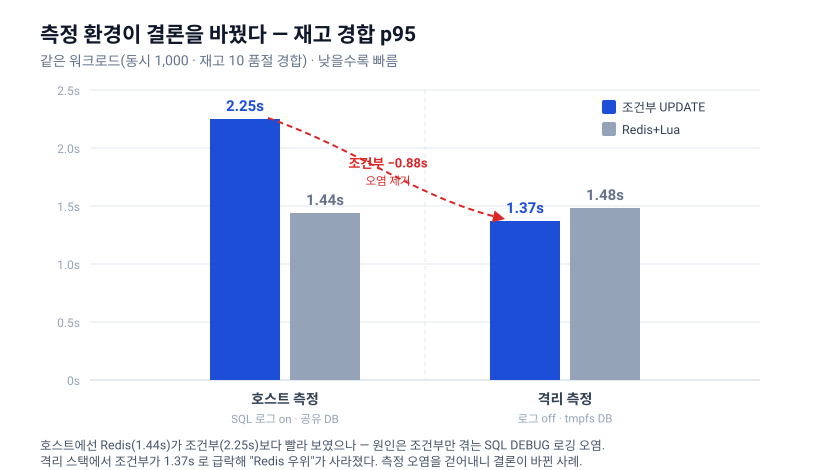
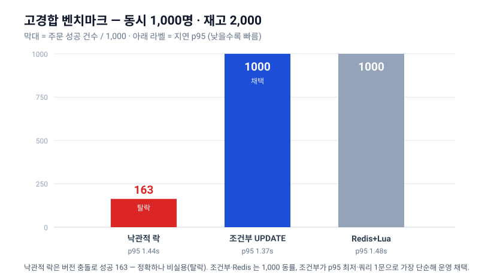
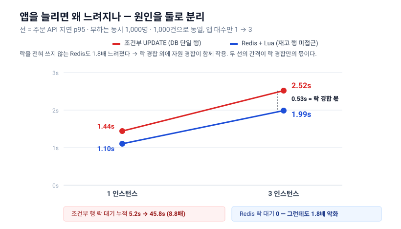

# 재고 동시성 벤치마크 — 측정과 해석

선착순 구매가 재고 한 행에 몰릴 때 어느 차감 방식을 쓸지, 세 가지를 같은 조건에서 재고 고른 과정이다.
결정 자체는 [재고 동시성 ADR](../adr/concurrency.md)에 있고, 이 문서는 그 근거가 되는 측정 설계와 실측을 보존한다.

## 1. 무엇을 재고 무엇을 재지 않았나

**측정 대상**

- 구매 경로에서 `HotDealStock` 한 행을 차감하는 경합 (`POST /api/orders`)
- 수천 요청이 같은 잔여 수량을 동시에 줄이는 지점이다

**측정한 세 가지**

- 낙관적 락(@Version) — 나쁜 기준선
- 원자적 조건부 UPDATE — 가장 단순한 DB 방식
- Redis + Lua — 고성능 대안

**재지 않은 두 가지**

- 비관적 락과 분산 락(Redisson)은 결과가 이론으로 예측돼 측정 이득이 낮다고 보았다
- `synchronized` 같은 JVM 락은 후보가 아니다. 자기 프로세스 안에서만 직렬화하므로 서버 여러 대에서는 초과 판매를 못 막는다

**부하를 주지 않은 곳**

- 토스 결제 승인 구간은 외부 샌드박스라 호출량 제한과 차단 위험이 있다
- 부하는 주문 생성 경로에만 주고, 결제는 테스트 대역으로 대체했다

### 측정 전에 세운 예상

벤치마크는 쏘고 보는 것이 아니라 예상을 검증하는 것이다.

| 방식 | 동작 | 한 행에 몰릴 때의 예상 |
|---|---|---|
| 낙관적 락(@Version) | 락 없이 진행하고 저장 시점에 버전을 비교 | 충돌률이 높아 대부분 실패 → 성공 처리량 최저 |
| 비관적 락(FOR UPDATE) | 행을 잠그고 줄을 세움 | 정확하지만 대기 내내 DB 커넥션을 쥔다 → 커넥션 풀이 먼저 마른다 |
| Redis + Lua | 인메모리·단일 스레드라 원자 차감 | 처리량 최고 예상. 단 재고를 Redis에서 관리하게 되어 DB 동기화가 따라온다 |
| 분산 락(Redisson) | Redis 락을 서버들이 공유해 직렬화 | 락을 얻고 푸는 왕복 비용 → Redis 직접 차감보다 느림 |
| 원자적 조건부 UPDATE | `WHERE remaining >= :qty` 한 문장, 영향 행 수로 판단 | 재시도도 긴 커넥션 점유도 없음 → 단순하고 정확할 것 |

예상이 있는데도 측정한 이유는 셋이다.

- 차이의 크기는 이론으로 나오지 않는다. 숫자가 있어야 운영안을 고른다
- 예상이 빗나갈 가능성이 실재한다. Redis는 단일 스레드라 고부하에서 예상만큼 안 빠를 수 있다
- "무엇을 예상했고, 얼마가 나왔고, 왜 그런가"를 남기는 것 자체가 목적이다

실무에도 같은 트레이드오프 탐색이 있다. 올리브영은 선착순 쿠폰 차감을 Lua로 전면 원자화해 정확성을 얻었으나 약 21% 느려졌고, 이중 카운터로 전환해 약 8% 비용에 정합을 지켰다 — [올리브영 테크블로그](https://oliveyoung.tech/2025-12-15/fcfs-coupon/).

## 2. 어떻게 재는가

### 무엇으로 재는가 — k6

도구를 고른 기준이 일반 부하 테스트와 다르다. 처리량 한계를 찾는 것이 아니라 **세 방식을 같은 조건으로 반복 측정해 비교**하는 것이라, 재현성과 서버 내부 지표가 먼저다.

- 보려는 지표가 클라이언트가 아니라 **앱 서버**에 있다. 커넥션 풀 포화·락 대기·버전 충돌은 부하 도구가 모른다
- 그래서 부하 곡선과 서버 지표를 **같은 시간축에 겹쳐** 봐야 "요청이 이만큼일 때 풀이 마른다"가 드러난다

| 도구 | 부하 제어 | 서버 지표 통합 | 시나리오 관리 |
|---|---|---|---|
| **k6** | 정확한 도착률 모델 | Prometheus·Grafana 한 생태계 | JS 파일 |
| Gatling | 동급 | 자체 리포트라 서버 지표와 분리 | Scala |
| JMeter | 스레드 모델이라 덜 정밀 | 플러그인 의존 | XML |

**가운데 열이 갈랐다.** Gatling 은 부하 제어가 동급이고 JVM 이라 익숙하지만, 리포트가 따로 놀아 두 곡선을 겹칠 수 없다. JMeter 는 도착률 정밀도와 버전 관리 둘 다에서 밀린다.

- 측정 스택은 k6(부하) + Micrometer→Prometheus(앱 지표) + Grafana(대시보드)다. k6 결과도 Prometheus 로 내보내 한 대시보드에 겹친다
- JS 를 쓰는 것이 유일한 이질점인데 측정 코드에만 갇혀 비용이 작다
- 도구를 바꾸는 비용은 시나리오 재작성뿐이다

### 전략 교체 구조

경합 지점이 항상 한 행이므로, 차감 방식만 교체하고 같은 부하를 다시 준다.

```java
public interface HotDealStockService {
  void createForHotDeal(Long hotDealId, int quantity);
  void deduct(Long hotDealId, int quantity);   // 실패 시 DomainException(SOLD_OUT)
  void restore(Long hotDealId, int quantity);  // 만료 복원 — 같은 행 연산이라 전략에 묶었다
}
```

| 전략 | 차감 동작 | 실패 신호 | 재고를 어디서 관리하나 |
|---|---|---|---|
| 낙관적 락(@Version) | 조회 → 엔티티 차감 → 커밋 시 버전 비교 | 버전 충돌 또는 잔여 부족 | DB (읽고 씀) |
| 원자적 조건부 UPDATE | `UPDATE … SET remaining = remaining − :qty WHERE hot_deal_id = :id AND remaining >= :qty` | 영향 행 없음 → `SOLD_OUT` | DB (읽지 않고 씀) |
| Redis + Lua | Redis 키에 Lua 스크립트로 원자 차감 | 스크립트 반환값 | Redis |

- `stock.deduct.strategy` 설정값과 `@ConditionalOnProperty`로 구현 하나만 활성화한다
- 설정만 바꿔 재기동하고 같은 k6 시나리오를 재실행하므로 방식 차이만 남는다
- 낙관적 락 구현과 `version` 컬럼은 운영 전략 확정 후 제거했다. 측정 결과는 이 문서에 남고, 코드는 git 히스토리에 있다

### 워크로드

- **시나리오** : 재고가 적은 핫딜 하나에 다수가 동시에 `POST /api/orders`를 보낸다
- **부하 모델** : k6 `shared-iterations`
  - 가상 사용자 N명이 총 N건을 나눠 처리한다. 계정당 1주문 제한이 있어 사용자 수가 곧 주문 수다
  - 도착률을 입력으로 주는 방식이 아니라 처리율이 결과로 나오는 구성이다
  - 그래서 방식 간 비교는 "같은 인원이 같은 건수를 소화하는 데 걸린 시간"으로 읽는다
- **매트릭스** : 저경합(100명·재고 10) / 고경합(1,000명·재고 2,000) / 품절 경합(1,000명·재고 10)
- **데이터** : 가상 사용자마다 다른 계정 토큰을 쓴다. 계정당 1활성주문 유니크를 통과해야 차감까지 도달한다
- **절차** : 예열 → 측정 → 종료 후 DB에서 초과 판매 0건을 단언

### 지표

| 출처 | 지표 | 무엇을 보나 |
|---|---|---|
| k6 | 주문 API 지연 p95 (`http_req_duration`) | SLA 판정 대상 |
| k6 | 처리율 (`iterations/s`) | 스케일아웃 효율 |
| k6 | 실패율과 실패 코드 | 정직한 실패와 경합 밀림을 구분 |
| DB | `Innodb_row_lock_waits` · `Innodb_row_lock_time` 델타 | 락 경합의 실체 |
| DB | `Threads_running` · `Threads_connected` | 실행 중인 쿼리와 열린 커넥션 |
| 앱 | `hikaricp_connections_active` | 커넥션 풀 사용량 |
| 부하 후 DB | `잔여 + 성공 주문 수량 = 총량` | 절대 불변식. 깨면 그 방식은 탈락 |

### 재현

```
k6 → nginx(LB) → 앱 컨테이너 ×1 또는 ×3 → MySQL 1 + Redis 1 (tmpfs)
```

- `bash k6/benchmark/run.sh` — 단일 스택
- `bash k6/benchmark/run-multi.sh` — 인스턴스 1 vs 3 ([run-multi.sh](../../k6/benchmark/run-multi.sh) · [docker-compose.multi.yml](../../k6/benchmark/docker-compose.multi.yml))
- 일회용 컨테이너로 전략을 순회하고 초과 판매 검증까지 자동으로 돈다 ([k6/README.md](../../k6/README.md))
- 인스턴스 1도 nginx를 경유시켜 앱 대수만 변수로 두었다. 앱 포트를 따로 여는 것은 부하용이 아니라 관측용이다
- 측정 오염을 막으려 만료·해소 스케줄러는 끄고 돌린다

## 3. 첫 측정에서 배운 것 — 측정 환경이 결론을 바꿨다



호스트에서 잰 첫 결과는 조건부 2.25초, Redis 1.44초로 **Redis가 앞서는 것처럼** 보였다.

- 원인은 조건부만 겪던 SQL 디버그 로깅이었다
- 격리 스택(로그 차단·tmpfs DB)에서 재측정하자 조건부가 1.37초로 떨어져 동률이 됐다
- 조건부는 차감이 DB UPDATE라 로깅에 민감하고, Redis는 메모리라 둔감했다

| 구간 (격리 환경) | 조건부 | Redis | 낙관적 락 |
|---|---|---|---|
| 저경합 100명·재고 10 (p95) | **266ms** | 344ms | 382ms |
| 고경합 1,000명·재고 2,000 (p95) | **1.37초** | 1.48초 | 1.44초 · 성공 163/1000 |
| 품절 경합 1,000명·재고 10 | 정확히 10 | 정확히 10 | 정확히 10 |

- 전 구간 초과 판매 0건 · 거짓 성공 0건 · 5xx 0%
- 낙관적 락은 재시도 없이 버전 충돌로 끝나 1,000건 중 163건만 성공했다. 정확하지만 실용성이 없어 탈락



지연은 셋이 비슷한데 **성공 건수에서 갈린다.** 재고가 인원보다 많아 원래 전원이 살 수 있는 조건인데도 낙관적 락만 837명을 떨어뜨렸다.

**측정 환경이 결론을 바꾼다**는 것이 이 벤치마크의 첫 교훈이다.

## 4. 앱을 늘렸을 때 — 원인을 둘로 분리했다

배포 전제가 서버 여러 대이므로 다중 인스턴스에서만 드러나는 것을 따로 측정했다. 부하를 동시 1,000명 · 1,000건으로 고정하고 앱 대수만 바꿨다.



| 전략 | 앱 | 주문 API p95 | 처리율 | 락 대기 횟수 | 락 대기 누적 |
|---|:--:|---|---|---|---|
| 원자적 조건부 UPDATE | 1 | 1.44초 | 7.14건/초 | 985회 | 5,220ms |
| 원자적 조건부 UPDATE | 3 | **2.52초** | 12.43건/초 | 999회 | **45,776ms** |
| Redis + Lua | 1 | 1.10초 | 13.75건/초 | 0 | 0 |
| Redis + Lua | 3 | **1.99초** | 12.54건/초 | 0 | 0 |

- 앱 1대에서는 Redis가 처리율 1.9배로 앞선다. 앱 3대에서는 둘이 수렴한다
- 지연은 두 전략 모두 나빠졌다. 조건부 1.75배, Redis 1.8배

### 정확성은 앱 대수와 무관하다

재고 10에 1,000명이 몰리는 품절 경합에서 **앱 3대에서도 성공은 정확히 10건, 초과 판매 0건**이다. 두 전략 모두 같다. 차감의 최종 직렬화가 DB나 Redis에 있으니 앱이 몇 대든 같다는 추론이 실측으로 올라섰고, 이 관측은 자원 경합과 무관해 로컬에서도 신뢰할 수 있다.

### 원인 ① 재고 행 락 경합 — 실재한다

- 조건부 UPDATE의 락 대기 누적이 5.2초에서 45.8초로 **8.8배** 늘었다
- 대기 횟수는 985회에서 999회로 거의 같다. 요청 수가 동일하니 당연하다
- **건당 대기 시간이 5.3ms에서 45.8ms로 8.6배** 길어진 것이 악화의 실체다

### 원인 ② 락과 무관한 요인 — 이것도 실재한다

- Redis는 재고 행을 수정하지 않아 락 대기가 정확히 0인데도 1.10초에서 1.99초로 1.8배 느려졌다
- 한 머신에서 앱 셋과 DB·Redis·nginx·k6가 자원을 나눠 쓴 몫으로 본다

### Redis가 대조군이 되어 둘이 갈린다

- 앱 3대에서 조건부 2.52초와 Redis 1.99초의 차이는 0.53초다. 이것을 **락 경합이 추가로 만든 몫으로 읽되, 값 자체는 신뢰하지 않는다**
  - 단일 측정이라 노이즈가 있다. 같은 조건의 두 실행이 1.37초와 1.44초로 갈린 것이 그 크기다(6절)
  - 두 전략은 락 말고도 다르다. 조건부는 DB UPDATE 경로 전체를 타고 Redis 는 명령 하나다. 그 차이도 0.53초 안에 섞여 있다
  - 신뢰하는 것은 **방향**이다. 락 대기 누적이 8.8배 늘었다는 관측이 그것을 뒷받침한다
- 나머지 악화는 두 전략이 함께 겪었으므로 락 밖 요인이다

### 관측 지표를 잘못 고르면 병목을 놓친다

2초 간격으로 찍은 34개 스냅샷은 이렇게 나왔다.

| 지표 | 값 |
|---|---|
| `Innodb_row_lock_current_waits` (그 순간 대기 중인 수) | **0** (34회 모두) |
| DB `Threads_running` | 2 (32회) · 3 (2회) |
| 앱이 사용 중인 커넥션 합산 | 대부분 0~2, 최고 30이 1회 |

**순간을 찍는 지표로는 락 경합이 전혀 보이지 않았다.** 누적값을 부하 전후 델타로 재고서야 45.8초가 드러났다. 대기가 짧고 잦으면 샘플링이 그 순간을 놓친다 — 이 프로젝트가 한때 "DB는 한가했다"고 잘못 읽은 이유다.

### 그런데도 Redis로 옮기지 않은 이유

- Redis의 이점은 속도만이 아니라 격리다. 재고 부하가 같은 DB의 주문·정산으로 번지지 않는다 ([여기어때 사례](https://techblog.gccompany.co.kr/redis-kafka%EB%A5%BC-%ED%99%9C%EC%9A%A9%ED%95%9C-%EC%84%A0%EC%B0%A9%EC%88%9C-%EC%BF%A0%ED%8F%B0-%EC%9D%B4%EB%B2%A4%ED%8A%B8-%EA%B0%9C%EB%B0%9C%EA%B8%B0-feat-%EB%84%A4%EA%B3%A0%EC%99%95-ec6682e39731))
- 대가는 정합과 유실 관리다. 현재 구현은 재고를 Redis에만 두는 벤치마크용이라 채택하려면 DB 동기화부터 완성해야 한다
- 앱 3대에서 두 전략의 처리율이 수렴한 것을 보면 **Redis 전환으로 얻는 이득도 환경에 따라 제한적**이다
- "대형사가 쓰니까"는 근거가 되지 않는다. [Shopify(2026)](https://shopify.engineering/scaling-inventory-reservations)는 오히려 Redis를 걷어내고 MySQL `SKIP LOCKED`와 재고 1단위 1행으로 고처리량을 냈다. 본질은 DB냐 Redis냐가 아니라 **한 행이냐 분산이냐**다

## 5. SLA 도출

주문 생성 `POST /api/orders` — 격리 스택 실측 분포에 여유를 붙여 올렸다 ([Google SRE Workbook](https://sre.google/workbook/slo-document/) 절차).

| 구간 | 실측 p95 | SLA |
|---|---|---|
| 저경합 (동시 100명·재고 10) | 266ms | **≤ 500ms** |
| 폭주 (동시 1,000명) | 1.37초 | **≤ 2초** |

- 동시 1,000명은 오픈 순간 구매 버튼을 함께 누르는 스파이크를 가정한다
- 초과 판매 0건과 거짓 성공 0건은 SLA가 아니라 절대 불변식이다. 지연은 목표선이지만 정확성은 협상 대상이 아니다
- p50은 재지 않았다. 선착순에서 관심사는 꼬리 지연이다
- SLA와 실사용자 경험의 상관은 검증하지 않았다. 운영 데이터가 생기면 조정한다

## 6. 아직 못 밝힌 것

- **자원 경합의 몫을 정밀하게 나누지 못했다.** Redis 대조로 락 경합분을 갈라냈다고 했지만 그 0.53초는 방향만 믿을 값이다(4절). 나머지가 CPU인지 네트워크인지 컨테이너 스케줄링인지도 모른다. 부하 도구·앱·DB를 각각 다른 기기에 두어야 가려지는데 장비 여건상 확인하지 못했다
- **tmpfs 환경**이라 실제 운영의 커밋 저장 비용이 빠져 있다. 디스크가 끼면 락 보유 시간이 길어져 결과가 달라진다
- **단일 측정**이라 절대 수치에 노이즈가 있다. 3절의 고경합 1.37초와 4절의 앱 1대 1.44초는 같은 조건인데도 다른 실행이라 값이 갈린다. 신뢰하는 것은 방향이지 값이 아니다
- **SLA를 실제로 깨는 지점**을 좁히지 않았다. 인원을 늘려가며 스윕해야 한다
- **`SKIP LOCKED` + 재고 단위별 행**(Shopify 방식)은 재보지 않았다. DB를 단일 진실로 유지하면서 한 행 경합만 없애는 접근이라 관심사다
- **가용성 목표선(SLO)을 세우지 않았고 알람도 붙이지 않았다.** 월 몇 분 다운을 허용한다는 목표선은 다중 노드·실트래픽·에러 예산 소진 추적이 있어야 뜻이 생기고, 알람은 임계 초과를 받을 수신자가 있어야 산다. 단일 로컬 환경에서 숫자를 지어내면 그쪽이 더 거짓이다
  - 다중 노드에서 실트래픽을 받게 되면 그때 목표선을 정하고 알람 임계를 1:1 로 환산한다

## 7. 전략 구현 테스트 리스트

낙관적 락은 기존 동시성 통합 테스트가 차감 경합을 명세한다. 아래는 신규 전략 구현이 자라며 누적한 단건 행위 테스트다. 전략 간 성능 차이는 테스트가 아니라 벤치마크의 몫이다.

실물은 [조건부 UPDATE 테스트](../../src/test/java/com/sparta/msa/commerce/domain/stock/ConditionalStockServiceIntegrationTest.java) · [Redis 전략 테스트](../../src/test/java/com/sparta/msa/commerce/domain/stock/RedisStockServiceIntegrationTest.java) 두 파일이고, 설정값이 실제로 구현을 가르는지는 [전략 선택 테스트](../../src/test/java/com/sparta/msa/commerce/domain/stock/DefaultStockStrategyIntegrationTest.java)가 본다.

| # | 테스트 | 전략 | 시나리오 | 상태 |
|---|---|---|---|---|
| 1 | `conditionalDeductReducesRemaining` | 조건부 UPDATE | 차감하면 잔여가 준다 | ✅ |
| 2 | `conditionalDeductRejectsWhenInsufficient` | 조건부 UPDATE | 잔여가 부족하면 영향 행이 없어 `SOLD_OUT`, 잔여는 그대로 | ✅ |
| 3 | `conditionalRestoreIncreasesRemaining` | 조건부 UPDATE | 복원하면 잔여가 는다 | ✅ |
| 4 | `conditionalDeductNoOversellUnderConcurrency` | 조건부 UPDATE | 동시 100명·재고 10에서 정확히 10건 성공, 초과 판매 0건 | ✅ |
| 5 | `redisDeductReducesRemaining` | Redis + Lua | 차감하면 Redis 잔여가 준다 | ✅ |
| 6 | `redisDeductRejectsWhenInsufficient` | Redis + Lua | 잔여가 부족하면 스크립트 반환값으로 `SOLD_OUT` | ✅ |
| 7 | `redisRestoreIncreasesRemaining` | Redis + Lua | 복원하면 Redis 잔여가 는다 | ✅ |
| 8 | `redisDeductNoOversellUnderConcurrency` | Redis + Lua | 동시 100명·재고 10에서 정확히 10건 성공, 초과 판매 0건 | ✅ |
